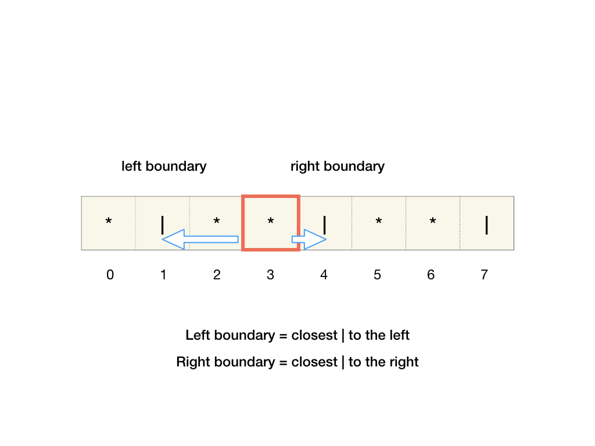
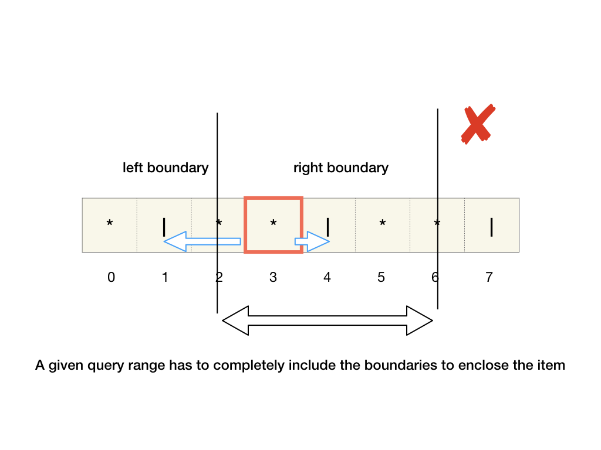
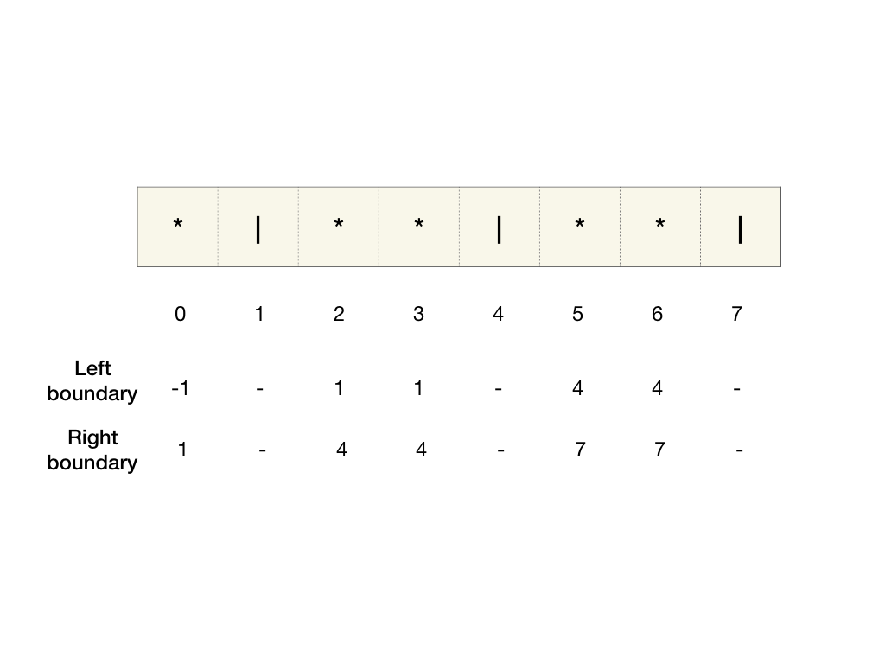
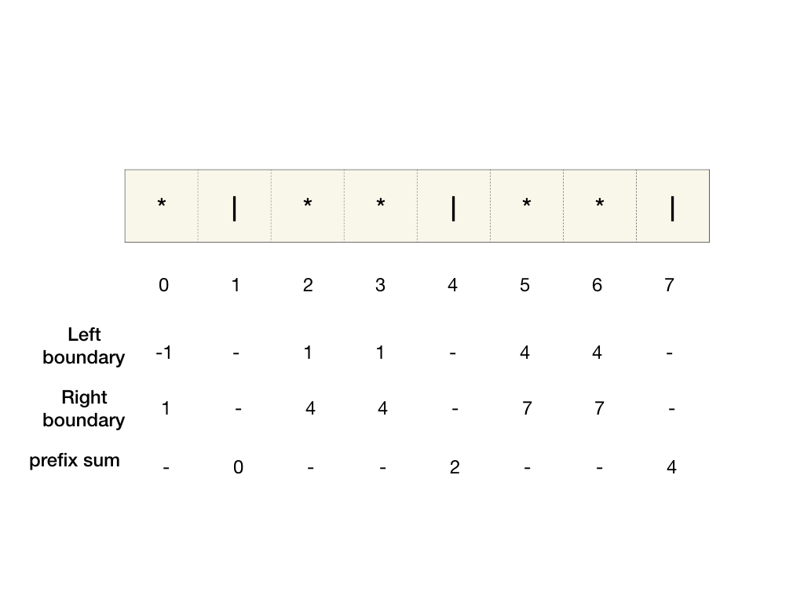
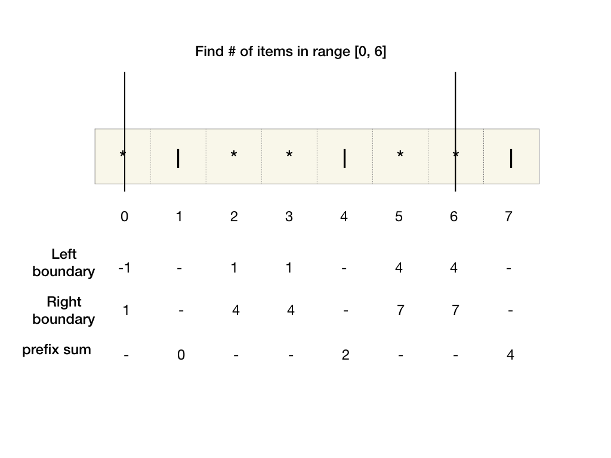
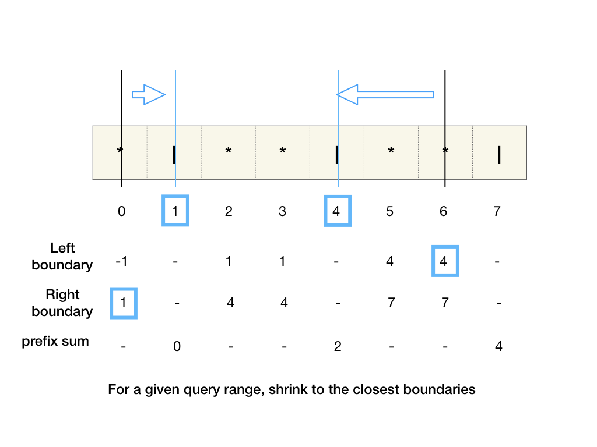
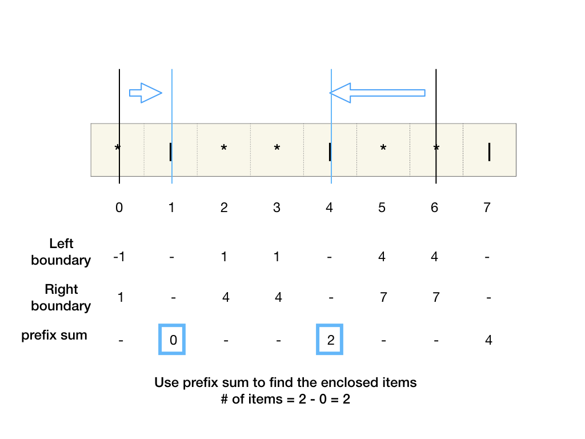

# Amazon OA

Resource: 

* [https://algo.monster/dashboard](https://algo.monster/dashboard)
* [https://www.teamblind.com/post/Amazon-OA-question-complilation-xjQosyo3](https://www.teamblind.com/post/Amazon-OA-question-complilation-xjQosyo3)
* [http://travelbynumbers.ca/problems/](http://travelbynumbers.ca/problems/amazon_oa_find_all_combination_of_numbers_sum_to_target)





## Mininum Total Container Size





[https://leetcode.com/problems/minimum-difficulty-of-a-job-schedule/](https://leetcode.com/problems/minimum-difficulty-of-a-job-schedule/)

Imagine we have moved `i` boxes in total after `d` days, and the total truck size we have used is `s(d, i)`. Notice that for fixed `i` and `d`, having a lower `s` is always better than a higher `s` \(since the available choices for later days are the same\).

For `d > 0`, we must have moved some number of boxes during the last day - let's say `k` boxes. Then `s(d, i)` is the sum of `s(d - 1, i - k)` \(the total truck size when we moved `i - k` boxes after `d - 1` days\) and the max of truck sizes from box `i - k` to box `i` \(truck size we used during the last day\). So the minimum possible `s(d, i)` is the minimum of all `s(d - 1, i - k) + max(sizes[i - k..i])` for all `k` in `1..i + 1` \(at least 1 every day, and at most all boxes\).

For `d = 0`, we haven't moved anything yet, so `s(d=0, i=0) = 0` \(total truck size 0\), and `s(d=0, i)` is impossible for `i != 0` \(moved non-0 boxes in 0 days\) which we will represent with infinity / int max \(since we want minimum\).

So we have an recurrence relation:

* `s(d=0, i=0) = 0`
* `s(d=0, i!=0) = inf`
* `s(d!=0, i) = min(s(d - 1, i - k) + max(sizes[i - k..i]) for k = 1..i + 1)`

We can write this out as a \(memoized\) recursive function \(top-down dynamic programming\):

```java
private static int dfs(int day, int box, List<Integer> boxSizes, HashMap<Entry<Integer, Integer>, Integer> memo) {
        if (day == 0)
            return box == 0 ? 0 : Integer.MAX_VALUE;
        Entry<Integer, Integer> key = Map.entry(day, box);
        if (memo.containsKey(key))
            return memo.get(key);
        int res = Integer.MAX_VALUE;
        // number of boxes moved during the last day
        for (int last = 1; last < box + 1; last++) {
            // max size of boxes moved during the last day
            int mx = boxSizes.subList(box - last, box).stream().mapToInt(Integer::intValue).max().getAsInt();
            int rec = dfs(day - 1, box - last, boxSizes, memo);
            if (rec != Integer.MAX_VALUE)
                res = Math.min(res, rec + mx);
        }
        memo.put(key, res);
        return res;
    }
    public static int minContainerSize(List<Integer> boxSizes, int days) {
        // WRITE YOUR BRILLIANT CODE HERE
        HashMap<Entry<Integer, Integer>, Integer> memo = new HashMap<>();
        return dfs(days, boxSizes.size(), boxSizes, memo);
    }
```

## Labeling System

```java
def labeling_system(original: str, limit: int) -> str:
    counter = Counter(original)
    heap = []
    for char, count in counter.items():
        heappush(heap, (-ord(char), char, count)) # -ord(char) to put largest character at the top
    res = []
    cur = None
    while heap:
        if cur is None:
            cur = heappop(heap)
        _, char, count = cur
        next = heappop(heap) # pop the next char out and set it as cur later to avoid consecutive chars
        if count <= limit:
            res.append(char * count)
        else:
            heappush(heap, (-ord(char), char, count - limit))
            res.append(char * limit)
        cur = next
    _, char, count = cur
    res.append(char * min(count, limit))
    return ''.join(res)
```

## Throttling Gateway

```java
static class Item {
        int time;
        int count;
        public Item(int time, int count) {
            this.time = time;
            this.count = count;
        }
    }
    static class Limiter {
        int duration;
        int limit;
        ArrayDeque<Item> queue = new ArrayDeque<>();
        int accum = 0;
        public Limiter(int duration, int limit) {
            this.duration = duration;
            this.limit = limit;
        }
        public void append(int time, int count) {
            while (!queue.isEmpty() && queue.peekFirst().time <= time - duration)
                accum -= queue.pollFirst().count;
            queue.offerLast(new Item(time, count));
            accum += count;
        }
    }
    public static int throttlingGateway(List<Integer> transactionTime) {
        // WRITE YOUR BRILLIANT CODE HERE
        List<Limiter> qs = List.of(new Limiter(1, 3), new Limiter(10, 20), new Limiter(60, 60));
        int dropped = 0;
        Map<Integer, List<Integer>> times = transactionTime.stream().collect(Collectors.groupingBy(i -> i));
        for (Entry<Integer, List<Integer>> e : times.entrySet()) {
            int time = e.getKey();
            int count = e.getValue().size();
            for (Limiter q : qs)
                q.append(time, count);
            dropped += Math.max(0, qs.stream().mapToInt(q -> q.accum - q.limit).max().getAsInt());
        }
        return dropped;
    }
```

## Break a Palindrome




```java
public String breakPalindrome(String palindrome) {
    char[] s = palindrome.toCharArray();
    int n = s.length;

    for (int i = 0; i < n / 2; i++) {
        if (s[i] != 'a') {
            s[i] = 'a';
            return String.valueOf(s);
        }
    }
    s[n - 1] = 'b';

    return n < 2 ? "" : String.valueOf(s);
}
```

## Count of Smaller Numbers after Self \| Number of Swaps to Sort \| 

  
You are given an integer array nums and you have to return a new counts array. The counts array has the property where `counts[i]` is the number of smaller elements to the right of `nums[i]`.

Input:

```text
    [5,2,6,1]
```

Output:

```text
    [2,1,1,0]
```

Explanation:

For the number 5, there are 2 numbers smaller than it after it. \(2 and 1\)

For the number 2, there is 1 number smaller than it after it. \(1\)

For the number 6, there is also 1 number smaller than it after it. \(1\)

For the number 1, there are no numbers smaller than it after it.

Hence, we have `[2, 1, 1, 0]`.

Another way to phrase the question is:

If we sort the array by finding the smallest pair `i, j` where `i < j` and `a[i] > a[j]` how many swaps are needed?

To answer that question we just have to sum up the numbers in the above output array: `2 + 1 + 1 = 5` swaps.

A third way to phrase the question is

Given an array and a sorting algorithm, the sorting algorithm will do a selection swap. Find the number of swaps to sort the array.  
Sample input:  
\[5,4,1,2\] -&gt; pair \(5,4\) -&gt; \[4,5,1,2\] -&gt; pair \(4,1\) -&gt; \[1,5,4,2\] -&gt; pair\(5,4\) -&gt; \[1,4,5,2\] -&gt; pair\(4,2\) -&gt; \[1,2,5,4\] -&gt; pair\(5,4\) -&gt; \[1,2,4,5\].

```java
    class Item {
        int val;
        int index;
        Item() {}
        Item(int val, int index) {
            this.val = val;
            this.index = index;
        }
    }
    public List<Integer> countSmaller(int[] nums) {
        List<Integer> result = new ArrayList<>();
        if (nums == null || nums.length == 0) {
            return result;
        }
        
        Item[] items = new Item[nums.length];
        Item[] temp = new Item[nums.length];
        int[] count = new int[nums.length];
        for (int i = 0; i < nums.length; i++) {
            items[i] = new Item(nums[i], i);
        }
        
        mergeSort(items, 0, nums.length - 1, temp, count);
        
        for (int item: count) {
            result.add(item);
        }
        
        return result;
    }
    
    private void mergeSort(Item[] items, int start, int end, Item[] temp, int[] count){
        if (start >= end) {
            return;
        }
        
        int mid = start + (end - start) / 2;
        mergeSort(items, start, mid, temp, count);
        mergeSort(items, mid + 1, end, temp, count);
        
        merge(items, start, end, temp, count);
    }
    
    private void merge(Item[] items, int start, int end, Item[] temp, int[] count) {
        int mid = start + (end - start) / 2;
        int left = start;
        int right = mid + 1;
        int index = start;
        int rightCount = 0;
        
        while (left <= mid && right <= end) {
            if (items[left].val <= items[right].val) {
                count[items[left].index] += rightCount;
                temp[index++] = items[left++];
            } else {
                rightCount++;
                temp[index++] = items[right++];
            }
        }
        
        while (left <= mid) {
            count[items[left].index] += rightCount;
            temp[index++] = items[left++];
        }
        
        while (right <= end) {
            temp[index++] = items[right++];
        }
        
        for (int i = start; i <= end; i++) {
            items[i] = temp[i];
        }
    }
```

## Item in container



[https://algo.monster/problems/items\_in\_containers](https://algo.monster/problems/items_in_containers)

















```java
    public static List<Integer> numberOfItems(String s, List<List<Integer>> ranges) {
        int n = s.length();
        HashMap<Integer, Integer> prefixSums = new HashMap<>();
        int curSum = 0;
        for (int i = 0; i < n; i++) {
            if (s.charAt(i) == '|')
                prefixSums.put(i, curSum);
            else
                curSum++;
        }
        int[] leftBounds = new int[n];
        int last = -1;
        for (int i = 0; i < n; i++) {
            if (s.charAt(i) == '|')
                last = i;
            leftBounds[i] = last;
        }
        int[] rightBounds = new int[n];
        last = -1;
        for (int i = n - 1; i >= 0; i--) {
            if (s.charAt(i) == '|')
                last = i;
            rightBounds[i] = last;
        }
        ArrayList<Integer> res = new ArrayList<>();
        for (int i = 0; i < ranges.size(); i++) {
            int start = rightBounds[ranges.get(i).get(0)];
            int end = leftBounds[ranges.get(i).get(1)];
            if (start != -1 && end != -1 && start < end)
                res.add(prefixSums.get(end) - prefixSums.get(start));
            else
                res.add(0);
        }
        return res;
    }
    
    public static void main(String[] args) {
        List<List<Integer>> ranges = new ArrayList<>();
        ranges.add(new ArrayList<Integer>());
        ranges.get(0).add(4);
        ranges.get(0).add(6);
        var result = numberOfItems("*|**|**|", ranges);
        System.out.println(result.get(0));
    }
```

## Substrings of Size K with Distinct Characters \| HackerRank SHL

Given a string `s` made up of lowercase alphabet characters, find all unique substrings containing distinct characters of length `k`.

#### Examples

**Example 1:**

**Input: s = xabxcd, k = 4**

**Output: \["abxc", "bxcd"\]**

**Explanation:**

Substrings of size `4` in `s` are `xabx`, `abxc`, and `bxcd`. However `x` repeats in the `xabx`, so it is not a valid substring made up of distinct characters.

**Example 2:**

**Input: s = aabcdbcd, k = 3**

**Output: \["abc", "bcd", "cdb", "dbc"\]**

**Explanation:**

The substrings with distinct characters are `abc`, `bcd`, `cdb`, `dbc`, and again `bcd`. However, we are only looking for unique substrings, so we discard the last one.

**Constraints:**

`k` is a positive number less than or equal to `26`.  


```java
public static List<String> substrings(String s, int k) {
    if (s == null || s.length() == 0 || k <= 0 || k > 26) {
        return new ArrayList<String>();
    }

    int len = s.length();
    Set<String> result = new HashSet<>();
    Set<Character> set = new HashSet<>();
    int i = 0, j = 0;

    while (j < len) {
        while (j < len && !set.contains(s.charAt(j)) && j - i < k) {
            set.add(s.charAt(j));
            j++;
        }

        if (j - i == k) {
            result.add(s.substring(i, j));
        }

        set.remove(s.charAt(i));
        i++;
    }

    List<String> temp = new ArrayList<>(result);

    return temp;
}
```

## Nearest Cities

A number of pins are placed on a 2D Cartesian grid. Each pin has an x-coordinate, a y coordinate, and a name.

Given a list of target pins, find the pin that share the same x or y coordinates with each of the target pin and return the list. If two pins have the same distance to the target pin, return the pin with the lexicographically smaller name.

**Example 1:**

**Input:**

pins = `["a", "b", "c", "d"]`

x\_coordinates = `[50, 60, 100, 200, 300]` y\_coordinates = `[50, 60, 50, 200, 50]`

target\_pins = `["a", "b","c", "d", "e"]`

**Output: \["c", "NONE", "a", "NONE", "c"\]**

**Explanation:**

`a`, `c` and `e` share the same y coordinate. For `a`, the closest is `c`. `b` shares no x or y coordinate with anyone. `c` shares the same y coordinate with a and e. The closest is `a`. `d` shares no x or y coordinate with anyone. `e` shares the same y coordinate with `a` and `c`. The closest is `c`.


* Solution: hashmap
  * we should build custom class if data access method is scattered.
  * time: O\(query \* n\), linear search can be optimized to lgn if we use treemap
  * space: O\(n\)

```java
static class Pin {
    int id;
    String name;
    int x;
    int y;

    Pin() {}
    Pin(int id, String name, int x, int y) {
        this.id = id;
        this.name = name;
        this.x = x;
        this.y = y;
    }
}
public static List<String> nearestPins(List<String> pins, List<Integer> xCoordinates, List<Integer> yCoordinates, List<String> queries) {
    Map<String, Pin> nameToPin = new HashMap<>();
    Map<Integer, Set<Pin>> xToPin = new HashMap<>();
    Map<Integer, Set<Pin>> yToPin = new TreeMap<>();
    for (int i = 0; i < pins.size(); i++) {
        int x = xCoordinates.get(i);
        int y = yCoordinates.get(i);
        Pin p = new Pin(i, pins.get(i), x, y);

        nameToPin.put(pins.get(i), p);

        xToPin.putIfAbsent(x, new HashSet<Pin>());
        xToPin.get(x).add(p);

        yToPin.putIfAbsent(y, new HashSet<Pin>());
        yToPin.get(y).add(p);
    }

    List<String> result = new ArrayList<>();
    for (String s: queries) {
        Pin p = nameToPin.get(s);
        int x = p.x;
        int y = p.y;
        Set<Pin> xSet = xToPin.get(p.x);
        Set<Pin> ySet = yToPin.get(p.y);
        ySet.addAll(xSet);
        Set<Pin> combined = ySet;

        int min = Integer.MAX_VALUE;
        Pin candidate = null;

        for (Pin item: combined) {
            if (item == p) {
                continue;
            }
            int dis = Math.abs(item.x - p.x) + Math.abs(item.y - p.y);
            if (dis < min) {
                min = dis;
                candidate = item;
            } else if (dis == min && item.name.compareTo(candidate.name) < 0){
                candidate = item;
            }
        }

        if (candidate == null) {
            result.add("NONE");
        } else {
            result.add(candidate.name);
        }
    }

    return result;
}
```

## Autoscale Policy, Utilization Check

A risk modeling system uses a scaling computing system that implements an autoscale policy depending on the current load or _utilization_ of the computing system.

The system starts with a number of computing instances given by `instances`. The system polls the instances every second to see the average utilization at that second, and performs scaling as described below. Once any action is taken, the system will stop polling for `10 seconds`. During that time, the number of instances does not change.

_**Average utilization &gt; 60%**_**:** Double the number of instances if the doubled value does not exceed `2 * 10^8`. This is an action. If the number of instances exceeds this limit on doubling, perform no action.

_**Average utilization &lt; 25%**_**:** Halve the number of instances if the number of instances is greater than 1 \(take ceil if the number is not an integer\). This is also an action. If the number of instances is 1, take no action.

_**25% &lt;= Average utilization &lt;= 60%**_: No action.

Given an array of the values of the average utilization at each second for this system, determine the number of instances at the end of the time frame.

For example, the system starts with _**instances = 2**_, and average utilization is given as _**averageUtil =** `[25, 23, 1, 2, 3, 4, 5, 6, 7, 8, 9, 10, 76, 80]`_.

At the first second, utilization is _**`25`**_, so no action is taken.

At the second second, `averageUtil[1] = 23 < 25`, so `instances = 2 / 2 = 1`. The next `10 seconds`, `averageUtil[2]..averageUtil[11]`, no polling is done.

At `averageUtil[11] = 76, 76 > 60` so the number of instances is doubled. There are no more readings to consider and `2` is the final answer.

#### Example 1:

**Input: averageUtil=\[5, 10, 80\], instances = 1**

**Output: 2**

**Explanation:**

Here _**instance = 1**_ and _**averageUtil = `[5, 10, 80]`**_. At the `1`st and `2`nd seconds of the time period, no action will be taken because the utilization is less than _**25%**_, the number of instance is `1`. At the `3`rd second, the number of instances will double to `2`.

#### Constraints:

* `1 <= instances <= 10^5`
* `1 <= n <= 10^5`
* `1 <= averageUtil[i] <= 100`


* Solution: simulation
  * time: O\(n\)
  * space: O\(1\)

```java
public static int autoScale(List<Integer> averageUtils, int numInstances) {
    int i = 0;
    while (i < averageUtils.size()) {
        if (averageUtils.get(i) < 25 && numInstances > 1) {
            numInstances = (int) Math.ceil((double) numInstances / 2);
            i += 11;
            continue;
        }
        if (averageUtils.get(i) > 60 && numInstances * 2 <= 2 * Math.pow(10, 8)) {
            numInstances *= 2;
            i += 11;
            continue;
        } 
        i += 1;
    }

    return numInstances;
}
```

## Cut off Rank

Each year, employees of an organization are rated based on their performance. The employees are then ranked based on the ratings. Enployees with the same ratings will have the same rankings, but the next employee with the next lowest score will be rated based on the position within the list of all rankings. Employees below the cutoff rank are placed in a layoff list.

Give the ratings each employee receives and the cutoff rank, return the number of employees who are not in the layoff list.

#### Example 1:

**Input: cutoff rank = 2, scores = \[100 90 80 70 60\]**

**Output: 2**

**Explanation:**

The employee rankings are `[1, 2, 3, 4, 5]`. And with a cutoff rank of two, only the first 2 employees are not in the layoff list.

#### Example 2:

**Input: cutoff rank = 4, scores = \[100 100 80 70 60\]**

**Output: 4**

**Explanation:**

The first two employees have equal rating and both receives a ranking of 1. Employee with score 80 has 2 employees in front of him so he receives a ranking of 3. The final employee rankings are `[1, 1, 3, 4, 5]`. With a cutoff rank of `4`, the first 4 employees are out of the layoff list.  


* Solution:
  * time: O\(nlgn\)
  * space: O\(1\)

```java
public static int cutOffRank(int cutOff, List<Integer> scores) {
    if (scores == null || scores.size() == 0) {
        return 0;
    }

    Collections.sort(scores, (a, b) -> {
        return b - a;
    });

    int curRank = 1;
    for (int i = 1; i < scores.size(); i++) {
        if (scores.get(i) != scores.get(i - 1)) {
            curRank = i + 1;
        }
        if (curRank > cutOff) {
            return i;
        }
    }

    return scores.size();
}
```

## Number Game

same as [https://leetcode.com/problems/maximize-score-after-n-operations/](https://leetcode.com/problems/maximize-score-after-n-operations/)

video tutorial: [https://www.youtube.com/watch?v=94vDosERuiI](https://www.youtube.com/watch?v=94vDosERuiI)

You are playing a card game with your friends. Every card is marked with a positive integer. You start the game with 2N cards on your hand, and the game lasts N rounds. In each round, you have to remove 2 cards from your hand.

Your score in each round is `gcd(card, card2) * round_number`, where `card` and `card2` are the cards that you removed and `round_number` is the current round. Your total score will be the sum of the scores that you received in each round.

What is the maximum total score that you can get?

#### Constraints

`1 <= n <= 10`, `n` represents the total number of rounds.

`1 <= cards[i] <= 10^9`, `cards` represents the array of the cards on your hand, and `cards[i]` represents the positive integer marked on card `i`.

The round\_number starts from 1.

#### Examples

**Example 1:**

**Input:**

n = `3`

cards = `[8, 5, 6, 25, 6, 16]`

**Output: 41**

**Explanation:**

The game can proceed as follow:

* round\_number 1: remove `card = 5`, `card2 = 25`, so `gcd(5, 25) * round_number = 5 * 1 = 5`.
* round\_number 2: remove `card = 6`, `card2 = 6`, so `gcd(6, 6) * round_number = 6 * 2 = 12`.
* round\_number 3: remove `card = 8`, `card2 = 16`, so `gcd(8, 16) * round_number = 8 * 3 = 24`.

The maximum total score is `5 + 12 + 24 = 41`.

* Solution: memo + bitmap. Amazon, are you demon?

```java
public static int getMaxScore(int n, List<Integer> cards) {
    return dfs(cards, n, 1, 0, new HashMap<Integer, Integer>());
}

private static int dfs(List<Integer> cards,
                       int n,
                       int round,
                       int state,
                       Map<Integer, Integer> memo) {
    if (round > n) {
        return 0;
    }

    if (memo.containsKey(state)) {
        return memo.get(state);
    }

    int ans = 0;
    for (int i = 0; i < cards.size(); i++) {
        for (int j = i + 1; j < cards.size(); j++) {
            int pick = 1 << i | 1 << j;
            if ((state & pick) == 0) {
                ans = Math.max(ans,
                               round * gcd(cards.get(i), cards.get(j)) +
                               dfs(cards, n, round + 1, state | pick, memo));
            }
        }
    }

    memo.put(state, ans);

    return ans;
}

private static int gcd(int a, int b) {
    return b == 0 ? a : gcd(b, a % b);
}
```

## Move The Obstacle \| Demolition Robot

You are in charge of preparing a recently purchased lot for the Company's building.

The lot is covered with trenches and has a single obstacle that needs to be taken down before the foundation is prepared for the building.

The demolition robot must remove the obstacle before the progress can be made on the building.

#### Assumptions

* The lot is flat, except the trenches, and can be represented by a 2D grid.
* The demolition robot must start at the top left corner of the lot, which is always flat, and can move on the block up, down, right, left
* The demolition robot cannot enter trenches and cannot leave the lot.
* The flat areas are indicated by `1`, areas with trenches are indicated by `0`, and the obstacle is indicated by `9`

#### Input

The input consists of one argument:

`lot`: a `2d grid of integers`

#### Output

Return an `integer` that indicated the minimum distance traversed to remove the obstacle else return `-1`

#### Constraints

`1 <= numRows`

`numColumns <= 1000`

#### Examples

**Example 1:**

**Input:**

```text
lot = [
  [1, 0, 0],
  [1, 0, 9],
  [1, 9, 1],
]
```

**Output: 3**

**Explanation**

Starting from the top-left corner, the demolition robot traversed the cells `(0,0) -> (1,0) -> (2,0) -> (2,1)`

The robot moves `3` times to remove the obstacle `9`

* Solution: bfs
  * time: O\(m \* n\)
  * space: O\(m \* n\) for visited arr, O\(m + n\) for q, overall O\(m\*n\). if we can modify the input, this could be O\(m + n\)

```java
public static int moveObstacle(List<List<Integer>> lot) {
    if (lot == null || lot.size() == 0) {
        return 0;
    }

    int[] dx = { 1, -1, 0, 0 };
    int[] dy = { 0, 0, -1, 1 };

    int m = lot.size();
    int n = lot.get(0).size();

    Queue<int[]> q = new ArrayDeque<>();
    q.offer(new int[] { 0, 0 });
    boolean[][] visited = new boolean[m][n];
    visited[0][0] = true;
    int dis = -1;

    while (!q.isEmpty()) {
        dis++;
        int size = q.size();
        for (int i = 0; i < size; i++) {
            int[] point = q.poll();
            int x = point[0];
            int y = point[1];
            if (lot.get(x).get(y) == 9) {
                return dis;
            }
            for (int j = 0; j < 4; j++) {
                int nx = x + dx[j];
                int ny = y + dy[j];
                if (!isValid(lot, nx, ny, m, n)) {
                    continue;
                }
                if (lot.get(nx).get(ny) == 0) {
                    continue;
                }
                if (visited[nx][ny]) {
                    continue;
                }
                q.offer(new int[] { nx, ny });
                visited[nx][ny] = true;
            }
        }
    }

    return -1;
}

private static boolean isValid(List<List<Integer>> lot, int x, int y, int m, int n) {
    return x >= 0 && x < m && y >= 0 && y < n;
}
```

## Robot Bounded in Circle

On an infinite plane, a robot is programmed to repeat a set of movements indefinitely. The robot starts at position `(0, 0)` facing north. The movement can be one of three:

* `"S"`: go straight 1 unit
* `"L"`: turn 90 degrees to the left
* `"R"`: turn 90 degrees to the right

Find out if there exists a circle in the plane such that the robot never leaves the circle.

#### Input

`movements`: a string made up of 'S', 'L', 'R' that determines the robot's future position on the plane.

#### Output

Return `true` if the robot is bounded in a circle in the plane; otherwise return `false`.

#### Constraints

* `1 <= movements.length <= 100`

#### Examples

**Example 1:**

**Input: "SSLLSS"**

**Output: true**

**Explanation:**

The robot moves from \(0, 0\) to \(0, 2\), turns 180 degrees to face south, and then returns to \(0, 0\). The robot remains in the circle of radius 2 centered at the origin at all times.

**Example 2:**

**Input: "SS"**

**Output: false**

**Explanation:**

The robot moves north indefinitely.

**Example 3:**

**Input: "SL"**

**Output: true**

**Explanation:**

The robot moves from \(0, 0\) -&gt; \(0, 1\) -&gt; \(-1, 1\) -&gt; \(-1, 0\) -&gt; \(0, 0\) -&gt; ..., circling around the perimeter of a square of size 1 on the plane.  


* Solution: 
  * time: O\(n\)
  * space: O\(1\)

```java
public static boolean isRobotBounded(String movements) {
    if (movements == null || movements.length() == 0) {
        return true;
    }

    char[] arr = movements.toCharArray();

    int[] dirX = { 0, -1, 0, 1 };
    int[] dirY = { 1, 0, -1, 0 };
    int dir = 0;

    boolean isMoved = true;
    int[] pos = {0, 0};

    for (char ch: arr) {
        if (ch == 'S') {
            pos[0] += dirX[dir];
            pos[1] += dirY[dir];
        } else if (ch == 'L') {
            dir = (dir + 1) % 4;
        } else if (ch == 'R') {
            dir = (dir - 1 + 4) % 4;
        }
    }

    if (pos[0] == 0 && pos[1] == 0) {
        isMoved = false;
    }

    if (dir != 0) {
        return true;
    } else if (dir == 0 && !isMoved) {
        return true;
    }

    return false;
}
```

## Fill The Truck 

A warehouse manager needs to create a shipment to fill a truck. All products loaded onto the truck should be packaged in boxes of the same size. One box can hold different number of units of product for each product type.

Given the number of boxes the truck can hold, write an algorithm to determine the maximum number of units of any mix of products that can be shipped.

#### Input

The input consists of five arguments:

`num`: an `integer` representing the number of product types in the warehouse

`boxes`: a `list of integers` representing the number of available boxes for each product type

`unitSize`: an `integer` representing size of the `unitsPerBox` list

`unitsPerBox`: a `list of integers` representing the number of units packed in a box for each product type

`truckSize`: an `integer` representing the number of boxes the truck can carry

#### Output

Return an `integer` representing the maximum units that can be carried by truck.

#### Constraints

`1 <= |boxes| <= 10^5`

`|boxes| == |unitsPerBox|`

`1 <= boxes[i] <= 10^7`

`1 <= i <= |boxes|`

`1 <= unitsParBox[i] <= 10^5`

`1 <= j <= |unitsPerBox|`

`1 <= truckSize <= 10 ^ 8`

#### Examples

**Example 1:**

**Input:**

num = `3`

boxes = `[1, 2, 3]`

unitSize = `3`

unitsPerBox = `[3, 2, 1]`

truckSize = `3`

**Output: 7**

**Explanation:**

`Product 0:` because `boxes[0] = 1`, we know there is `1` box of product `0`. And because `unitsPerBox[0] = 3`, we know there is `1` box with `3` units of product `0`.

`Product 1:` `2` boxes with `2` units each

`Product 2:` `3` boxes with `1` unit each

Finally, we have packed products like the list: `[3, 2, 2, 1, 1, 1]`

The `truckSize` is `3`, so we pick the top `3` boxes from the above list, which is `[3, 2, 2]`, and return the sum `7`.

The maximum number of units that can be shipped = `3 + 2 + 2 = 7` units.

* Solution: greedy
  * time: O\(nlgn\)
  * space: O\(n\)

```java
public static int fillTheTruck(int num, List<Integer> boxes, int unitSize, List<Integer> unitsPerBox, int truckSize) {
    List<Integer> list = new ArrayList<>();
    for (int i = 0; i < boxes.size(); i++) {
        for (int j = 1; j <= boxes.get(i); j++) {
            list.add(unitsPerBox.get(i));
        }
    }

    Collections.sort(list, (a, b) -> {
        return b - a;
    });


    int sum = 0;
    int count = 0;
    for (int item: list) {
        sum += item;
        count++;
        if (count > truckSize) {
            sum -= item;
            count--;
            break;
        }
    }

    return sum;
}
```

## Debt Records \| Smallest Negative Balance

An international organization is investigating debt across countries. Given a list of records representing amounts of money owed between each country, find the country with the largest negative balance.

Return the list consisting of the string "No countries have debt." if all countries zero out their owed amounts.

#### Input

`debts`: an array consisting of [`borrower country` string, `lender country` string, `amount` number](https://algo.monster/problems/debt_records) triplets, each representing a debt record.

#### Output

A list of countries with the largest debt. If there are multiple countries with the same maximum debt amount, sort them alphabetically.

Return a list containing the string `"No countries have debt."` if there is no debt.

#### Example

| Borrower | Lender | Amount |
| :--- | :--- | :--- |
| USA | Canada | `2` |
| Canada | USA | `2` |
| Mexico | USA | `5` |
| Canada | Mexico | `7` |
| USA | Canada | `4` |
| USA | Mexico | `4` |

**Explanation:**

**For USA:**

The `first`, `fifth`, and `sixth` entries decrease the balance because they are a `borrower`.

The `second` and `third` entries increase because they are a lender.

Their balance is `(2 + 5) - (2 + 4 + 4) = 7 - 10 = -3`.

**For Canada:**

They are a lender in `first` and `fifth` entries and a borrower in the `second` and `fourth` entries.

Their balance is `(2 + 4) - (2 + 7) = 6 - 9 = -3`.

**For Mexico:**

They are a borrower in the `third` entry and a lender in the `fourth` and `sixth` entries.

Thus, `Mexico's` balance is `(7 + 4) - 5 = 11 - 6 = 5`.

**Here USA and Canada both have the balance of -3, which is the minimum net balance among all countries.**

* Solution: hashmap
  * time: O\(n\)
  * space: O\(n\)

```java
public static List<String> debtRecords(List<List<String>> debts) {
        Map<String, Integer> map = new HashMap<>();
        for (List<String> d: debts) {
            String a = d.get(0);
            String b = d.get(1);
            int balance = Integer.parseInt(d.get(2));
            map.put(a, map.getOrDefault(a, 0) - balance);
            map.put(b, map.getOrDefault(b, 0) + balance);
        }
        
        int min = Integer.MAX_VALUE;
        List<String> result = new ArrayList<>();
        for (String key: map.keySet()) {
            int balance = map.get(key);
            if (balance >= 0) {
                continue;
            }
            if (balance < min) {
                min = balance;
                result.clear();
                result.add(key);
            } else if (balance == min) {
                result.add(key);
            }
        }
        
        if (result.size() > 0) {
            Collections.sort(result);
        } else {
            result.add("No countries have debt.");
        }
        
        return result;
    }
```

## Shopping Patterns

[https://www.1point3acres.com/bbs/forum.php?mod=viewthread&tid=672261](https://www.1point3acres.com/bbs/forum.php?mod=viewthread&tid=672261)

Shoe Monster, a popular shopping website for atheletic shoes, would like to know which shoes are frequently bought together.

When a customer purchases two shoes together, we log an `edge` between the two products. Three shoes that are interconnected form a `triple`.

A score for a `triple` can be calculated by counting the total number of shoes outside the triple that are joined with a shoe inside the triple. This is the `product sum`.

Find the minimum `product sum` in the graph, or return `-1` if no triples exist.

#### Input

The input to the function/method consists of four arguments:

`int products_nodes`: the total number of shoe products for sale. Each shoe is identified by a number from `1` to `product_nodes`.

`int products_from[]`: the list of products on the left side of each edges

`int products_to[]`: the list of products on the right side of each edge

#### Output

`int`: the minimum `product sum` or `-1` if no triples exist.

#### Constraints

There is always at least two products and one edge. All edges are valid, ie. they do not refer to itself, and are a valid product number, ie. between `1` and `product_nodes`.

#### Examples

**Example 1:**

**Input:**

`products_nodes = 6`

`products_edges = 6`

`products_from = [1, 2, 2, 3, 4, 5]`

`products_to = [2, 4, 5, 5, 5, 6]`

| Product | Related Products |
| :--- | :--- |
| `1` | `2` |
| `2` | `1,4,5` |
| `3` | `5` |
| `4` | `2,5` |
| `5` | `2,3,4,6` |
| `6` | `5` |

A graph of `n = 6` products where the only triple of related products is `(2, 4, 5)`.

| Product | Outside Products | Which Products Are Outside |
| :--- | :--- | :--- |
| 2 | 1 | 1 |
| 4 | 0 |  |
| 5 | 2 | 3, 6 |

In the diagram above, the total product score is `1 + 0 + 2 = 3` for the triple `(2, 4, 5)`.

**Output: 3**

**Example 2:**

**Input:**

`products_nodes = 5`

`products_edges = 6`

`products_from = [1, 1, 2, 2, 3, 4]`

`products_to = [2, 3, 3, 4, 4, 5]`

**Output: 2**

**Explanation:**

There are two possible triples: `{1,2,3}` and `{2,3,4}`

The score for `{1,2,3}` is `0 + 1 + 1 = 2`.

The score for `{2,3,4}` is `1 + 1 + 1 = 3`.

Return `2`.

```java
    public int minTrioDegree(int n, int[][] edges) {
        Map<Integer, Set<Integer>> graph = new HashMap<>();
        Map<Integer, Integer> degree = new HashMap<>();
        for (int i = 1; i <= n; i++) {
            graph.put(i, new HashSet<>());
        }
        for (int[] edge: edges) {
            int u = edge[0], v = edge[1];
            graph.get(Math.min(u, v)).add(Math.max(u, v));
            degree.put(u, degree.getOrDefault(u, 0) + 1);
            degree.put(v, degree.getOrDefault(v, 0) + 1);
        }
        
        int ans = Integer.MAX_VALUE;
        for (int i = 1; i <= n; i++) {
            for (int j: graph.get(i)) {
                for (int k: graph.get(j)) {
                    if (graph.get(i).contains(k)) {
                        ans = Math.min(ans, degree.get(i) + degree.get(j) + degree.get(k) - 6);
                    }
                }
            }
        }
        
        return ans == Integer.MAX_VALUE ? -1 : ans;
    }
```

```java
    //v2
    public static int shoppingPatterns(int productsNodes, List<Integer> productsFrom, List<Integer> productsTo) {
        List<HashSet<Integer>> neighbors = IntStream.range(0, productsNodes).mapToObj(i -> new HashSet<Integer>()).collect(Collectors.toList());
        for (int i = 0; i < productsFrom.size(); i++) {
            // convert from 1-based to 0-based indexing
            int u = productsFrom.get(i) - 1;
            int v = productsTo.get(i) - 1;
            neighbors.get(u).add(v);
            neighbors.get(v).add(u);
        }
        int minSum = Integer.MAX_VALUE;
        // all (u, v, w) where
        // - (u, v), (v, w), (u, w) are neighbors (trio)
        // - u < v < w (to avoid duplicates, as optimization)
        for (int u = 0; u < neighbors.size(); u++) {
            HashSet<Integer> u_ns = neighbors.get(u);
            for (int v : u_ns) {
                if (v < u)
                    continue;
                for (int w : u_ns) {
                    HashSet<Integer> v_ns = neighbors.get(v);
                    if (w < u || !v_ns.contains(w))
                        continue;
                    HashSet<Integer> w_ns = neighbors.get(w);
                    // each neighbors set include the other 2 in the trio,
                    // which we don't count in product score
                    int curSum = u_ns.size() + v_ns.size() + w_ns.size() - 6;
                    minSum = Math.min(minSum, curSum);
                }
            }
        }
        return minSum != Integer.MAX_VALUE ? minSum : -1;
    }
```

## Most Common Word with Exclusion List

Find the most frequently used word, which is not listed in `ignored_keywords`, within a `paragraph`. A paragraph is a single line of words that may contain punctuation marks, mixed with uppercase and lowercase letters. The word comparison should not be case sensitive, and the output word is expected to be in lowercase.

#### Examples

**Example 1:**

**Input:**

paragraph = `"If this book was written today in the midst of the slew of dystopian novels that come out, it may not have stood out. But, this book was way ahead of its time."` ignored\_keywords = `["of", "was", "the"]`

**Output: "book"**

**Explanation:**

`"of"` appears three times and `"was"`, `"the"` appear twice, but they are in the `ignored_keywords` list. The next most common word is `"book"`, which appears twice.

#### Constraints

There is always at least one word in the paragraph and at least one word in the list of excluded keywords. The most common keyword frequency count that is not in `ignored_keywords` will always be unique. Keywords in the exclusion list only consist of lowercase alphabetical characters.

* Solution: String maniputation
  * time: O\(n\)
  * space: O\(n\)

```java
public static String mostCommonWord(String paragraph, List<String> banned) {
    String normalizedStr = paragraph.replaceAll("\\W+", " ").toLowerCase().trim();
    String[] tokens = normalizedStr.split("\\s+");

    Map<String, Integer> map = new HashMap<>();
    for (String token: tokens) {
        map.put(token, map.getOrDefault(token, 0) + 1);
    }

    Set<String> set = new HashSet<>(banned);
    String result = "";
    int count = 0;

    for (String key: map.keySet()) {
        int cur = map.get(key);
        if (cur > count && !set.contains(key)) {
            result = key;
            count = cur;
        }
    }

    return result;
}
```

## Turnstile

[https://leetcode.com/discuss/interview-question/699973/goldman-sachs-oa-turnstile](https://leetcode.com/discuss/interview-question/699973/goldman-sachs-oa-turnstile)

A warehouse has one loading dock that workers use to load and unload goods.

Warehouse workers carrying the goods arrive at the loading dock at different times. They form two queues, a "loading" queue and an "unloading" queue. Within each queue, the workers are ordered by the time they arrive at the dock.

The arrival time \(in minutes\) array stores the minute the worker arrives at the loading dock. The direction array stores whether the worker is "loading" or "unloading", a value of 0 means loading and 1 means unloading. Loading/unloading takes 1 minute.

When a worker arrives at the loading dock, if no other worker is at the dock at the same time, then the worker can use the dock.

If a "loading" worker and an "unloading" worker arrive at the dock at the same time, then we decide who can use the dock with these rules:

* if the loading dock was not in use in the previous minute, then the unloading worker can use the dock.
* if the loading dock was just used by another unloading worker, then the unloading worker can use the dock.
* if the loading dock was just used by another loading worker, then the loading worker can use the dock.

Return an array of the time \(in minute\) each worker uses the dock.

#### Examples

**Example 1:**

**Input:**

time = `[0, 0, 1, 6]` direction = `[0, 1, 1, 0]`

**Output:**

`[2, 0, 1, 6]`

**Explanation:**

* At time `0`, worker `0` and `1` want to use the dock. Worker `0` wants to load and worker `1` wants to unload. The dock was not used in the previous minute, so worker `1` unload first.
* At time `1`, workers `0` and `2` want to use the rock. Worker `2` wants to unload, and at the previous minute the dock was used to unload, so worker `2` uses the dock.
* At time `2`, worker `0` is the only worker at the dock, so he uses the dock.
* At time `6`, worker `3` arrives at the empty dock and uses the dock.

We return `[2, 0, 1, 6]`.

```java
    public static List<Integer> getTimes(int numworker, List<Integer> arrTime, List<Integer> direction) {
        // WRITE YOUR BRILLIANT CODE HERE
        ArrayDeque<Map.Entry<Integer, Integer>> enterQueue = new ArrayDeque<>();
        ArrayDeque<Map.Entry<Integer, Integer>> exitQueue = new ArrayDeque<>();
        int curTime = -1;
        String lastUsedType = "exit";
        for (int i = 0; i < numworker; i++) {
            if (direction.get(i) == 0)
                enterQueue.offer(Map.entry(arrTime.get(i), i));
            else
                exitQueue.offer(Map.entry(arrTime.get(i), i));
        }
        List<Integer> ans = Arrays.asList(new Integer[numworker]);
        while (!enterQueue.isEmpty() && !exitQueue.isEmpty()) {
            ArrayDeque<Map.Entry<Integer, Integer>> curQueue;
            if (enterQueue.peek().getKey() <= curTime && exitQueue.peek().getKey() <= curTime) {
                if (curTime == -1 || lastUsedType == "exit")
                    curQueue = exitQueue;
                else
                    curQueue = enterQueue;
            } else if (enterQueue.peek().getKey() < exitQueue.peek().getKey()) {
                curQueue = enterQueue;
            } else {
                curQueue = exitQueue;
            }
            Map.Entry<Integer, Integer> worker = curQueue.poll();
            int time = worker.getKey();
            int i = worker.getValue();
            lastUsedType = curQueue == enterQueue ? "enter" : "exit";
            curTime = Math.max(time, curTime);
            ans.set(i, curTime);
            curTime++;
        }
        ArrayDeque<Map.Entry<Integer, Integer>> remainingQueue = !enterQueue.isEmpty() ? enterQueue : exitQueue;
        while (!remainingQueue.isEmpty()) {
            Map.Entry<Integer, Integer> worker = remainingQueue.poll();
            int time = worker.getKey();
            int i = worker.getValue();
            curTime = Math.max(time, curTime);
            ans.set(i, curTime);
            curTime++;
        }
        return ans;
    }
```

```java
    // more clear
    public static int[] getTimes(int[] times, int[] directions) {
        int[] res = new int[times.length];

        Queue<Integer> entry = new LinkedList<>();
        Queue<Integer> exit = new LinkedList<>();
        for (int i = 0; i < directions.length; i++) {
            if (directions[i] == 0) {
                entry.add(i);
            } else {
                exit.add(i);
            }
        }

        int curTime = 0;
        int prev = 1;
        int lastPassTime = 0;
        while (!exit.isEmpty() && !entry.isEmpty()) {
            int curExit = exit.peek();
            int curEntry = entry.peek();
            int timeExit = Math.max(curTime, times[curExit]);
            int timeEntry = Math.max(curTime, times[curEntry]);

            if (timeEntry == timeExit) {
                if (timeEntry - lastPassTime > 1) { // check prev work or not
                    exit.poll();
                    res[curExit] = timeExit;
                    prev = 1;
                    lastPassTime = timeExit;
                    curTime = timeExit;
                } else {
                    if (prev == 1) {
                        exit.poll();
                        res[curExit] = timeExit;
                        prev = 1;
                        lastPassTime = timeExit;
                        curTime = timeExit;
                    } else {
                        entry.poll();
                        res[curEntry] = timeEntry;
                        prev = 0;
                        lastPassTime = timeEntry;
                        curTime = timeEntry;
                    }
                }
            } else if (timeEntry < timeExit) {
                entry.poll();
                res[curEntry] = timeEntry;
                prev = 0;
                lastPassTime = timeEntry;
                curTime = timeEntry;
            } else {
                exit.poll();
                res[curExit] = timeExit;
                prev = 1;
                lastPassTime = timeExit;
                curTime = timeExit;
            }
            curTime++;
        }

        while (!entry.isEmpty()) {
            int curEntry = entry.poll();
            int timeEntry = Math.max(curTime, times[curEntry]);
            res[curEntry] = timeEntry;
            curTime = Math.max(curTime, timeEntry);
            curTime++;
        }
        while (!exit.isEmpty()) {
            int curExit = exit.poll();
            int timeExit = Math.max(curTime, times[curExit]);
            res[curExit] = timeExit;
            curTime = Math.max(curTime, timeExit);
            curTime++;
        }
        return res;
    }

```

## Five Star Seller

An arborist that operates a plant store in Brooklyn, NY would like to improve their online sales by improving their ratings.

In order to become a five-star store, they must maintain a certain threshold percentage of five-star ratings. Given their current situation, find the minimum number of additional five-star ratings they must receive to meet the threshold. The overall online store percentage is calculated by taking the sum of percentages of five-star ratings for each product.

#### Examples

**Example 1:**

**Input:**

`productCount` = `3`

`productRatings` = `[[4,4],[1,2],[3,6]]` where each entry is `[five-star reviews, total reviews]`

`threshold` = `77`

**Output: 3**

**Explanation :**

We need the sum of the percentages of five-star ratings for each product to add up to the threshold.

The current percentage of five-star ratings for this seller is `((4/4) + (1/2) + (3/6))/3 = 66.66%`

If we add a five star review to product \#2, their threshold becomes `((4/4) + (2/3) + (3/6))/3 = 72.22%`

If we add another five star review to product \#2, their threshold becomes `((4/4) + (3/4) + (3/6))/3 = 75%`

If we add a five star review to product \#3, their threshold becomes `((4/4) + (3/4) + (4/7))/3 = 77.38%`

At this point, the `77%` threshold is met. The answer is `3`, because there is no other way to add less ratings and achieve `77%` or more.

#### Constraints:

There is always at least one product, and the threshold is between `1` and `99` inclusive. All values are positive.

Alternative description:

[https://leetcode.com/problems/maximum-average-pass-ratio](https://leetcode.com/problems/maximum-average-pass-ratio)

#### Which class should an extra student go to?

We want to add an extra student to the class where he can make the most impact. Impact is measured as how much the average score the class can gain, i.e. `average score after adding the student - average score before adding the student`. We call this the "gain" by adding the student.

#### "Gain" has diminishing returns

Imagine a class with two students: one passing the other one failing. The passing ratio is 50%. By adding another passing student the ratio becomes `2/3 = 66%`. The gain is `66%-50%=16%`. However, adding one more student the ratio is `3/4=75%` with a `75%-16%=11%` gain. Therefore the gain reduces as more students are added.

Since the gain of a class changes when we add a student to it, we have to keep track of the max gain as we add students. A good data structure for this is a max heap.

#### Greedy + Heap

To summarize, we use a max heap to keep track of the gains. While we have extra students, we pop the class with highest gain out of the heap, add the extra student to it and push it back into the max heap.

#### Complexity

Each time we pop from the heap it's `O(log(n))` and with `k` students and a final loop to find the sum, the total is `O(klog(n) + n)`.  


* Solution: heap + greedy
  * time: O\(nlgn + times of change \* lgn\)
  * space: O\(n\)

```java
static class Rating {
    int n;
    int d;
    double rating;
    double increasing;

    Rating() {}
    Rating(int n, int d) {
        this.n = n;
        this.d = d;
        this.rating = (double) n / d;
        this.increasing = (double) (n + 1) / (d + 1) - this.rating;
    }
}
public static int fiveStarReviews(List<List<Integer>> ratings, int threshold) {
    Queue<Rating> q = new PriorityQueue<>((a, b) -> {
        if (a.increasing < b.increasing) {
            return 1;
        } else if (a.increasing == b.increasing) {
            return 0;
        } else {
            return -1;
        }
    });

    int size = ratings.size();
    double average = 0;

    for (List<Integer> rating: ratings) {
        int n = rating.get(0);
        int d = rating.get(1);
        average += (double) n / d;
        q.offer(new Rating(n, d));
    }
    average /= size;

    int count = 0;
    while (average * 100 < threshold) {
        Rating r = q.poll();
        average += r.increasing / size;
        q.offer(new Rating(r.n + 1, r.d + 1));
        count++;
    }

    return count;
}
```

##  Winning Sequence

Given the lower and upper bound of a range of integers, find the largest "mountain array". A mountain array is defined as in the [Peak of mountain array](https://algo.monster/problems/peak_of_mountain_array) problem, i.e. An array that

* has at least 3 elements
* let's call the element with the largest value the "peak", with index `k`. The array elements monotonically increase from the first element to `A[k]`, and then monotonically decreases from `A[k + 1]` to the last element of the array. Thus creating a "mountain" of numbers.

If more tham one valid mountain arrays can be built from a given range of integers, the largest array is the one with the maximum values starting from the left side. For example, `[6, 7, 6, 5]` is larger than `[5, 6, 7, 5]` because first value is larger in the first array.

Return the largest mountain array satisfying the constraints, or -1 if it's not possible.

#### Examples

**Example 1:**

**Input: num = 4, lowerEnd = 3, upperEnd = 10**

**Output: \[9 10 9 8\]**

**Example 2:**

**Input: num = 5, lowerEnd = 1, upperEnd = 3**

**Output: \[1 2 3 2 1\]**

## Split String Into Unique Primes

Given a string made up of kk, 0 to 9, count the number of ways to split the string into prime numbers in the range of 2 to 1000 inclusive, using up all the characters in the string.

Each prime number, `pn`, must not contain leading 0s, and `2 <= pn <= 1000`.

#### Constraints

The input string does not contain any leading 0s.

#### Examples

**Example 1:**

**Input: "31173"**

**Output: 6**


**Explanation:**

The string "31173" can be split into prime numbers in 6 ways:

* `[3, 11, 7, 3]`
* `[3, 11, 73]`
* `[31, 17, 3]`
* `[31, 173]`
* `[311, 7, 3]`
* `[311, 73]`


* Solution: \`count prime\` + dp
  * time: O\(1000 + len\)
  * space: O\(1000 + len\)

```java
public static int splitPrimes(String inputStr) {
    if (inputStr == null || inputStr.length() == 0) {
        return 0;
    }
    boolean[] isPrime = new boolean[1001];
    Arrays.fill(isPrime, true);
    isPrime[0] = false;
    isPrime[1] = false;
    for (int i = 2; i * i <= 1000; i++) {
        if (!isPrime[i]) {
            continue;
        }
        for (int j = i * i; j <= 1000; j += i) {
            isPrime[j] = false;
        }
    }

    int len = inputStr.length();
    int[] dp = new int[len + 1];
    dp[0] = 1;

    for (int i = 1; i <= len; i++) {
        if (i >= 1 && isPrime[Integer.parseInt(inputStr.substring(i - 1, i))]) {
            dp[i] += dp[i - 1];
        }
        if (i >= 2 && inputStr.charAt(i - 2) != '0' && isPrime[Integer.parseInt(inputStr.substring(i - 2, i))]) {
            dp[i] += dp[i - 2];
        }
        if (i >= 3 && inputStr.charAt(i - 3) != '0' && isPrime[Integer.parseInt(inputStr.substring(i - 3, i))]) {
            dp[i] += dp[i - 3];
        }
    }

    return dp[len];
}
```

## Pairs of Songs With Total Durations Divisible by 60

Given a list of numbers and a target number. Find the number of pairs of numbers from the list whose sum is divisible by 60.

**Example 1:**

**Input: \[30,20,150,100,40\]**

**Output: 3**

**Explanation:**

\(30, 150\), \(20, 100\) and \(20, 40\) are pairs of numbers whose sum are divisible by 60.

* Solution: 
  * a lot of time, we need to write down the formula first to observe
  * watch out the case when map entry key is 0
  * time: O\(n\)
  * space: O\(n\) or O\(1\) if we use arr bucket

```java
public static int numPairsDivisibleBy60(List<Integer> times) {
    if (times == null || times.size() == 0) {
        return 0;
    }

    Map<Integer, Integer> map = new HashMap<>();
    int total = 0;

    for (int time: times) {
        int cur = time % 60;
        int target = cur == 0 ? 0 : 60 - cur;
        if (map.containsKey(target)) {
            total += map.get(target);
        } 
        map.put(cur, map.getOrDefault(cur, 0) + 1);
    }

    return total;
}
```

## Storage Optimization

You have a paper box with dividers for holding wine bottles.


The box is divided by `m x n` dividers into `(m + 1) x (n + 1)` cells. Assuming the depth of the box is 1, each cell has a volume of 1.

Now we want to remove a number of dividers. Find the largest space after removing the dividers.

#### Example 1:

**Input:**

`n = 5` Number of dividers in the horizontal direction

`m = 5` Number of dividers in the vertical direction

`h = [2, 3]` Horizontal dividers to remove

`v = [3]` Vertical dividers to remove

**Output: 6**

**Explanation:**

We want to remove the 2nd and 3rd horizontal divider and the 3rd vertical divider. The largest space after removing the dividers has a volume of `(4 - 1) * (4 - 2) * 1 = 6`.


* Solution: greedy
  * same question as cutting cake
  * when we have a condition where the out of bound condition need to be dealt with, we could adopt this double while loop pattern where the outer loop will control the whole iteration will never be out of bound and the inner loop will deal with special condition. \`if\` condition only triggers when we are still in bound. maxH execution will trigger no matter if we are out of bound or reach a secial condition
  * time: O\(hlgh + vlgv + h + v\)
  * space: O\(1\)

```java
public static int storageOptimization(int n, int m, List<Integer> h, List<Integer> v) {
    Collections.sort(h);
    Collections.sort(v);

    int start = h.get(0) - 1;
    int end = start + 1;
    int i = 0;
    int maxH = 1;
    while (i < h.size()) {
        while (i < h.size() && h.get(i) == end) {
            end++;
            i++;
        }
        maxH = Math.max(maxH, end - start);
        if (i < h.size()) {
            start = h.get(i) - 1;
            end = start + 1;
        }
    }

    start = v.get(0) - 1;
    end = start + 1;
    i = 0;
    int maxV = 1;
    while (i < v.size()) {
        while (i < v.size() && v.get(i) == end) {
            end++;
            i++;
        }
        maxV = Math.max(maxV, end - start);
        if (i < v.size()) {
            start = v.get(i) - 1;
            end = start + 1;
        }
    }

    return maxH * maxV;
}
```

## Minimum Cost to Connect All Nodes \(Minimum Spanning Tree I\)

Monster Airlines has a set of `n` destination cities and a list of flight paths connecting some of the cities together. Your job is to find the flight paths that would connect all of the cities together, but with minimum total travel distance.

#### Input

The input consists of three arguments:

`n` = the number of nodes \(ie. cities\). The cities are represented by numbers `1...n`.

`edges` = an array of flight paths, represented by pairs of numbers corresponding to the cities being connected.

`costs` = a list of distances in number triplets. The first two numbers represent the cities being connected, and the last number is the distance. For example, `[1,2,3]` would state that the distance between cities `1` and `2` is `3`. Due to certain constraints, not all cities can be connected, so if a triplet is not found in this list, it is not possible to connect them.

#### Examples

**Example 1:**

**Input: n = 6, edges = \[\[1, 4\], \[4, 5\], \[2, 3\]\], costs = \[\[1, 2, 5\], \[1, 3, 10\], \[1, 6, 2\], \[5, 6, 5\]\]**

**Output: 7**

**Explanation:**

The edges can be collected into interconnected groups of cities, ie. `[1, 4, 5]`, `[2, 3]`, and `[6]`. This helps identify what needs to be connected.

The cheapest path between the first and second group is `[1, 2]`. The cheapest path between the first and third group is `[1, 6]`, and there is no available path between the second and third group.

The cost of each path is `5` and `2` respectively, therefore the total cost is `5 + 2 = 7`.

**hint:** What’s the time complexity of your algorithm? Can you make the running time `O(E * log(E))` by using union find?

* Solution:  union find + greedy
  * time: without path compression O\(elge\); with path compression: O\(e\)
  * space: O\(n\)

```java
static class UnionFind {
    Map<Integer, Integer> valueMap;
    Map<Integer, Integer> sizeMap;
    int count;

    UnionFind() {
        valueMap = new HashMap<>();
        sizeMap = new HashMap<>();
        count = 0;
    }

    void add(int a) {
        if (valueMap.containsKey(a)) {
            return;
        }
        valueMap.put(a, a);
        sizeMap.put(a, 1);
        count++;
    }

    void union(int a, int b) {
        if (!valueMap.containsKey(a) || !valueMap.containsKey(b)) {
            return;
        }

        int pa = find(a);
        int pb = find(b);

        if (pa == pb) {
            return;
        }
        if (sizeMap.get(pa) <= sizeMap.get(pb)) {
            valueMap.put(pa, pb);
            sizeMap.put(pb, sizeMap.get(pa) + sizeMap.get(pb));
        } else {
            valueMap.put(pb, pa);
            sizeMap.put(pa, sizeMap.get(pa) + sizeMap.get(pb));
        }
        count--;
    }

    int find(int a) {
        int cur = a;
        while (valueMap.get(cur) != cur) {
            int parent = valueMap.get(cur);
            valueMap.put(cur, valueMap.get(parent));
            cur = parent;
        }
        return cur;
    }
}
public static int minCostToConnectNodes(int n, List<List<Integer>> edges, List<List<Integer>> costs) {
    UnionFind uf = new UnionFind();
    for (int i = 1; i <= n; i++) {
        uf.add(i);
    }
    for (List<Integer> edge: edges) {
        int a = edge.get(0);
        int b = edge.get(1);
        uf.union(a, b);
    }

    Collections.sort(costs, (a, b) -> {
        return a.get(2) - b.get(2);
    });

    int sum = 0;
    for (List<Integer> cost: costs) {
        int a = cost.get(0);
        int b = cost.get(1);
        int pa = uf.find(a);
        int pb = uf.find(b);
        if (pa == pb) {
            continue;
        }
        uf.union(a, b);
        sum += cost.get(2);
    }

    return sum;
}
```

## Find All Combination of Numbers that Sum to a Target \| Shopping Options



description: [https://www.chegg.com/homework-help/questions-and-answers/2-shopper-s-delight-shopaholic-buy-pair-jeans-pair-shoes-skirt-top-budgeted-dollars-given--q58094309](https://www.chegg.com/homework-help/questions-and-answers/2-shopper-s-delight-shopaholic-buy-pair-jeans-pair-shoes-skirt-top-budgeted-dollars-given--q58094309)

explaination: [https://www.youtube.com/watch?v=9dkMC7\_Afsc](https://www.youtube.com/watch?v=9dkMC7_Afsc)

Given four arrays of integers and an integer `limit`. We need to pick 1 number from each of the four arrays such that the sum of the selected numbers is smaller or equal to `limit`. Find the number of valid combinations.

#### Example

**Input:**

```text
a = [2, 3, 5]
b = [5]
c = [2, 3, 10]
d = [1, 2]
limit = 11
```

**Output: 4**


We can pick the numbers in the following four ways: `[2, 5, 2, 1], [2, 5, 3, 1], [2, 5, 2, 2], [3, 5, 2, 1]`. So return 4.

* Solution1: knapsack dp
  * time: O\(4 \* limit \* \(a + b + c + d\)\)
  * space: O\(4 \* limit\)
  * cons: if limit is huge, this could lead to huge memory consumption and time is depend on limit

```java
public static int numberOfOptions(List<Integer> a, List<Integer> b, List<Integer> c, List<Integer> d, int limit) {
    int[][] dp = new int[4][limit + 1];
    for (int j = 1; j <= limit; j++) {
        for (int num: a) {
            if (num <= j) {
                dp[0][j]++;
            }
        }
    }

    for (int i = 1; i < 4; i++) {
        for (int j = 1; j <= limit; j++) {
            if (i == 1) {
                induction(dp, b, i, j);
            } else if (i == 2) {
                induction(dp, c, i, j);
            } else if (i == 3) {
                induction(dp, d, i, j);
            }
        }
    }

    return dp[3][limit];
}

private static void induction(int[][] dp, List<Integer> list, int i, int j) {
    for (int num: list) {
        if (j - num >= 0) {
            dp[i][j] += dp[i - 1][j - num];
        }
    }
}
```

* Solution 2: cannot understand

```java
//v2:
    private static class Acc {
        // cost of (lowest, highest) combination
        public int low;
        public int high;
        // number of all combinations, ignoring limit
        public int combs;
        public Acc(int low, int high, int combs) {
            this.low = low;
            this.high = high;
            this.combs = combs;
        }
    }
    private static int search(int item, int limit, List<List<Integer>> allNumbers, ArrayList<Acc> accs, HashMap<Entry<Integer, Integer>, Integer> memo) {
        Entry<Integer, Integer> key = Map.entry(item, limit);
        if (memo.containsKey(key))
            return memo.get(key);
        // for persistent scan optimization
        List<Integer> num0 = allNumbers.get(0);
        // right boundary of `num0` with `<= left` number
        int b0 = num0.size();
        List<Integer> numbers = allNumbers.get(item - 1);
        Acc acc = accs.get(item - 1);
        int ways = 0;
        for (int number : numbers) {
            int left = limit - number;
            // extreme case optimization
            if (left < acc.low) {
                // not enough for cheapest combination, so 0 options;
                // same for higher `number`, so break
                break;
            }
            if (left >= acc.high) {
                // enough for all combinations
                ways += acc.combs;
                continue;
            }
            // persistent scan optimization
            if (item == 2) {
                // will not go out of bounds because of `left < low` check
                while (num0.get(b0 - 1) > left)
                    b0--;
                // boundary is persisted between loops,
                // so faster than a linear scan every time
                ways += b0;
                continue;
            }
            ways += search(item - 1, left, allNumbers, accs, memo);
        }
        memo.put(key, ways);
        return ways;
    }
    
    public static int numberOfOptions(List<Integer> a, List<Integer> b, List<Integer> c, List<Integer> d, int limit) {
        List<List<Integer>> allNumbers = List.of(a, b, c, d);
        int n = allNumbers.size();
        for (List<Integer> numbers : allNumbers)
            numbers.sort(null);
        ArrayList<Acc> accs = new ArrayList<>();
        accs.add(new Acc(0, 0, 1));
        for (List<Integer> numbers : allNumbers) {
            Acc last = accs.get(accs.size() - 1);
            int low = numbers.get(0) + last.low;
            int high = numbers.get(numbers.size() - 1) + last.high;
            int combs = numbers.size() * last.combs;
            accs.add(new Acc(low, high, combs));
        }
        HashMap<Entry<Integer, Integer>, Integer> memo = new HashMap<>();
        return search(n, limit, allNumbers, accs, memo);
    }
```

* Solution3: 4sum variant

  * [https://www.youtube.com/watch?v=9dkMC7\_Afsc](https://www.youtube.com/watch?v=9dkMC7_Afsc)
  * [https://pcs.cs.cloud.vt.edu/submissions/12969](https://pcs.cs.cloud.vt.edu/submissions/12969)
  * time: O\(n^2 \* lgn^2 + m^2 lgn^2\)
  * space: O\(n^2 + m^2\)
  * pros: decoupled with limit

```java
//v1
class Solution {
    public static void main(String[] args) {
        Scanner reader = new Scanner(System.in);
        int a = reader.nextInt();
        int[] arrA = new int[a];
        for (int i = 0; i < a; i++) arrA[i] = reader.nextInt();
        int b = reader.nextInt();
        int[] arrB = new int[b];
        for (int i = 0; i < b; i++) arrB[i] = reader.nextInt();
        int c = reader.nextInt();
        int[] arrC = new int[c];
        for (int i = 0; i < c; i++) arrC[i] = reader.nextInt();
        int d = reader.nextInt();
        int[] arrD = new int[d];
        for (int i = 0; i < d; i++) arrD[i] = reader.nextInt();
        int budget = reader.nextInt();
        
        Integer[] ab = new Integer[a * b];
        int idx_ab = 0;
        for (int i = 0; i < a; i++) {
            for (int j = 0; j < b; j++) {
                ab[idx_ab++] = arrA[i] + arrB[j];
            }
        }

        Integer[] cd = new Integer[c * d];
        int idx_cd = 0;
        for (int i = 0; i < c; i++) {
            for (int j = 0; j < d; j++) {
                cd[idx_cd++] = arrC[i] + arrD[j];
            }
        }

        Arrays.sort(ab);
        Arrays.sort(cd, (num1, num2)-> {
            return num2 - num1;
        });

        int l = 0, r = 0;
        long result = 0;
        while (l < a * b && r < c * d) {
            if (ab[l] + cd[r] > budget) {
                r++;
            } else {
                result += c * d - r;
                l++;
            }
        }

        System.out.println(result);
    }
}
```

```java
//v2
import java.util.*;
public class Shopping {
    public static void main(String[] args) {
        Scanner reader = new Scanner(System.in);
        int a = reader.nextInt();
        int[] arrA = new int[a];
        for (int i = 0; i < a; i++) arrA[i] = reader.nextInt();
        int b = reader.nextInt();
        int[] arrB = new int[b];
        for (int i = 0; i < b; i++) arrB[i] = reader.nextInt();
        int c = reader.nextInt();
        int[] arrC = new int[c];
        for (int i = 0; i < c; i++) arrC[i] = reader.nextInt();
        int d = reader.nextInt();
        int[] arrD = new int[d];
        for (int i = 0; i < d; i++) arrD[i] = reader.nextInt();
        int budget = reader.nextInt();
        int ab = a * b;
        int[] arrAB = new int[ab];
        for (int i = 0; i < a; i++) {
            for (int j = 0; j < b; j++) {
                arrAB[i * b + j] = arrA[i] + arrB[j];
            }
        }
        int cd = c * d;
        int[] arrCD = new int[cd];
        for (int i = 0; i < c; i++) {
            for (int j = 0; j < d; j++) {
                arrCD[i * d + j] = arrC[i] + arrD[j];
            }
        }
        Arrays.sort(arrAB);
        Arrays.sort(arrCD);
        reverse(arrCD, arrCD.length);
        long sum = 0;
        int end = 0;
        for (int i = 0; i < arrAB.length; i++) {
            int val = arrAB[i];
            int left = budget - val;
            while (end < arrCD.length && arrCD[end] > left) end++;
            if (end == arrCD.length) break;
            sum += (arrCD.length - end);
        }
        System.out.println(sum);
    }
    
    static void reverse(int a[], int n) 
    { 
        int i, k, t; 
        for (i = 0; i < n / 2; i++) { 
            t = a[i]; 
            a[i] = a[n - i - 1]; 
            a[n - i - 1] = t; 
        } 
    } 

}
```

## Earliest Time To Complete Deliveries \| Schedule Deliveries


You are the manager of logistics for a burger franchise, and you are tasked with delivering supplies as quickly as possible.

There are `n` restaurants with `4` receiving docks each. Each dock has a specified maximum receiving rate.

#### Input

`n` = number of restaurants

`openTimes` = a number that represents the time the `i`th restaurant opens

`deliveryTimeCost` = an array of numbers representing the time it takes to unload a delivery. There are exactly `n * 4` values in this list.

#### Output

The earliest time all deliveries can be completed.

#### Examples

**Example 1:**

**Input:**

`n = 2`

`openTimes = [8, 10]`

`deliveryTimeCost = [2,2,3,1,8,7,4,5]`

**Output: 16**

**Explanation:**

For the restaurant that opens at `8`, assign deliveries with cost `[8, 7, 5, 4]`. These will complete at `(8+8), (8+7), (8+5)`, and `(8+4)`, which are `16, 15, 13,` and `12` respectively.

For the restaurant that opens at `10`, assign deliveries with cost `[3, 2, 2, 1]`. These will complete at `(10+3), (10+2), (10+2)`, and `(10+1)`, which are `13, 12, 12`, and `11` respectively.

The lastest of all of the delivery completion time is at `16`.

* Solution: greedy
  * It's better to assign longer tasks to docks that open earlier because the combined finish time would be minimized. Sort dock ascending and offloading sort time descending, and then assign time to dock.

```java
public static int earliestTime(int n, List<Integer> openTimes, List<Integer> deliveryTimeCost) {
    Collections.sort(openTimes);
    Collections.sort(deliveryTimeCost, (Integer a, Integer b) -> {
        return b - a;
    });

    int ans = 0;
    int index = 0;

    for (Integer openTime: openTimes) {
        ans = Math.max(ans, openTime + deliveryTimeCost.get(index));
        index += 4;
    }

    return ans;
}
```

## Transaction Logs

A startup that builds a chat app wants to identify highly social users. All the chat data is in a large log file with three values on each line - the sender ID, receipient ID, and the number of messages. Given a `threshold` number, find the number of users that appear at least as many times as this threshold.

**For example:**

```text
USERA USERB 14
USERA USERC 94
USERB USERB 3
 ...
```

**Note:** On the third line, a user sents a message to himself.

**Inputs**

`logs` = a list of lines where each line is a string

`threshold` = a number

**Output:**

Return a list of sorted user IDs. If the same user appears in the same line, only count them once.

#### Example:

**Input:**

logs:

```text
345366 899212 45
029323 382391 23
382391 345366 15
029323 382391 77
345366 382391 23
029323 345366 13
382391 382391 23
...
```

threshold: `3`

**Output: \[029323, 345366, 382391\]**

**Explanation:**

There are three users that have appear more than `3` times:

`345366` appears 4 times.

`382391` appears 5 times.

`029323` appears 3 times.  


* Solution1:  
  * time: O\(nlgn\)
  * space: O\(n\)

```java
public static List<String> getUserIds(List<String> logs, int threshold) {
    Map<String, Integer> map = new HashMap<>();
    List<String> result = new ArrayList<>();

    for (String log: logs) {
        String[] tokens = log.split("\\s+");
        String a = tokens[0];
        String b = tokens[1];
        if (!map.containsKey(a)) {
            map.put(a, 1);
        } else {
            map.put(a, map.get(a) + 1);
        }
        if (!map.containsKey(b)) {
            map.put(b, 1);
        } else if (map.containsKey(b) && !a.equals(b)) {
            map.put(b, map.get(b) + 1);
        }
    }

    for (String key: map.keySet()) {
        if (map.get(key) >= threshold) {
            result.add(key);
        }
    }

    Collections.sort(result, (String a, String b) -> {
        return a.compareTo(b);
    });

    return result;
}
```

Solution2:

```java
public static List<String> getUserIds(List<String> logs, int threshold) {
    Map<String, Integer> map = new HashMap<>();
    List<String> result = new ArrayList<>();

    for (String log: logs) {
        String[] tokens = log.split("\\s+");
        String a = tokens[0];
        String b = tokens[1];
        map.put(a, map.getOrDefault(a, 0) + 1);
        if (!a.equals(b)) {
            map.put(b, map.getOrDefault(b, 0) + 1);
        }
    }

    for (String key: map.keySet()) {
        if (map.get(key) >= threshold) {
            result.add(key);
        }
    }

    Collections.sort(result, (String a, String b) -> {
        return a.compareTo(b);
    });

    return result;
}
```

## Optimizing Box Weights

Given a multiset \(set that allows for multiple instances of same value\), partition it into two multisets `A` and `B` such that the sum of `A` is greater than that of `B`. Return `A`. If more than one such `A`s exists, return the one with minimal size.

#### Examples

**Example 1:**

**Input:**

`nums = [4, 5, 2, 3, 1, 2]`

**Output:**

`[4, 5]`

**Explanation:**

We can divide the numbers into two subsets `A = [4, 5]` and `B = [1, 2, 2, 3]`. The sum of A is 9 which is greater than the sum of B which is 8. There are other ways to divide but `A = [4, 5]` is of minimal size of 2.

Solution1: time: O\(nlgn\). space: O\(n\). 

* thoughts: 
  * there might be an issue with this approach. this assume we must put at least 1 item in set. what if we have case like \[4, 4\]? can we make 1 set having \[4, 4\] and the other as \[\]?
  * if so, we need to check if the last sum is == prefix\[0\]

```java
public static List<Integer> optimizingBoxWeights(List<Integer> arr) {
    if (arr == null || arr.size() == 0) {
        return new ArrayList<Integer>();
    }

    Collections.sort(arr);

    int size = arr.size();
    int[] prefix = new int[size];
    prefix[0] = arr.get(0);

    for (int i = 1; i < size; i++) {
        prefix[i] = prefix[i - 1] + arr.get(i);
    }

    int sum = 0;
    List<Integer> result = new ArrayList<>();
    for (int i = size - 1; i >= 1; i--) {
        sum += arr.get(i);
        result.add(arr.get(i));
        if (sum > prefix[i - 1]) {
            break;
        }
    }

    Collections.reverse(result);

    return result;
}
```

Solution2: 

If we sort the array, the subset A with maximal total weight is the shortest trailing subarray with sum greater than half of the total sum, e.g. for the example above,

```text
sorted(arr) = [1, 2, 2, 3, 4, 5]
sum(arr) / 2 = 17 / 2 = 8.5
A = [4, 5]
sum(A) = 9
```

Now, we can just sort the array and extract the subarray and call it a day, but there is a more efficient approach. Notice that we don't need the whole array in sorted order — we only need to extract the largest elements in descending order, which seems like a perfect opportunity for a [priority queue](https://algo.monster/problems/heap_intro).

Therefore, we put all the values into a heap through heapify \(note: inserting one by one would defeat the purpose, as that would take `O(n log n)` time which is on the same magnitude as sorting\). We then pop one element at a time into a separate array, until the sum of the removed elements is larger than half the total sum. The removed elements are in descending order, so we reverse the result array before returning.

For input of size `n` and output of size `m`, this approach takes `O(n + m log n)` as opposed to `O(n log n)` by sorting, which is faster in all cases and especially so if the output size is small.

build heap using q.addAll\(Collection\) can heapify the collection and using O\(n\) time

```java
public static List<Integer> optimizingBoxWeights(List<Integer> arr) {
    if (arr == null || arr.size() == 0) {
        return new ArrayList<Integer>();
    }

    PriorityQueue<Integer> q = new PriorityQueue<>((Integer a, Integer b) -> {
        return b - a;
    });
    q.addAll(arr);

    int sum = 0;
    for (int i = 0; i < arr.size(); i++) {
        sum += arr.get(i);
    }
    int average = sum / 2;

    List<Integer> result = new ArrayList<>();
    int curSum = 0;

    while (curSum <= average) {
        int num = q.poll();
        curSum += num;
        result.add(num);
    }

    Collections.reverse(result);

    return result;


}
```

## Optimal Utilization

Find a pair of entries from two lists that yield a sum that is as close to a `target` number as possible, without exceeding it.

Each entry in a list is a key-value pair, where the key is a number identifier and the value is also a number. The output must be a list containing the pairs of numbers representing the identifiers that yield the result.

If a solution is not possible, return an empty list.

#### Input

`a` = an array of `number pairs` where the first number is an identifier and the second number is a value.

`b` = Same as `a`. Each identifier is unique in each list.

`target` = a number

#### Examples

**Example 1:**

**Input:**

`a = [[1, 2], [2, 4], [3, 6]]`, `b = [[1, 2]]`, `target = 7`,

**Output: \[\[2, 1\]\]**

**Explanation:**

There are only three possible pairs, `[1, 1]`, `[2, 1]`, and `[3, 1]`. They yield the sum values of `2 + 2 = 4`, `4 + 2 = 6` and `6 + 2 = 8` respectively.

`6` is the largest number that does not exceed `7`, therefore `[2, 1]` is the optimal pair.

**Example 2:**

**Input:**

`a = [[1, 3], [2, 5], [3, 7], [4, 10]]`, `b = [[1, 2], [2, 3], [3, 4], [4, 5]]`, `target = 10`,

**Output: \[\[2, 4\], \[3, 2\]\]**

**Explanation:**

There are two pairs possible. The element with `id = 2` from list `a` has a value of `5`, and the element with `id = 4` from list `b` also has a value of `5`. Combined, they add up to `10`.

Likewise, the element with `id = 3` from `a` has a value of `7`, and the element with `id = 2` from `b` has a value of `3`. These also add up to `10`.

Therefore, the optimal pairs are `[2, 4]` and `[3, 2]`.

**Example 3:**

**Input:**

`a = [[1, 8], [2, 7], [3, 14]]`, `b = [[1, 5], [2, 10], [3, 14]]`, `target = 20`,

**Output: \[\[3, 1\]\]**

**Example 4:**

**Input:**

`a = [[1, 8], [2, 15], [3, 9]]`, `b = [[1, 8], [2, 11], [3, 12]]`, `target = 20`,

**Output: \[\[1, 3\], \[3, 2\]\]**

* Solution: 
  * time: O\(nlgn + mlgm\)
  * space: O\(m + n\)
* thoughts: this is tricky 2-sum question. since we must pick 1 from a and pick another from b, after sorting both list, we can have 1 pointer points to the smallest item from a, and another pointer points to the largest item from b. The tricky part is that once we encounter a duplicate, we cannot simply change right pointer's value, because the left pointer could still use it since every item has a unique id.

```java
public static List<List<Integer>> getPairs(List<List<Integer>> a, List<List<Integer>> b, int target) {
    Collections.sort(a, (l1, l2) -> {
        return l1.get(1) - l2.get(1);
    });
    Collections.sort(b, (l1, l2) -> {
        return l1.get(1) - l2.get(1);
    });

    int l = 0, r = b.size() - 1;
    int maxSum = Integer.MIN_VALUE;
    List<List<Integer>> result = new ArrayList<>();

    while (l < a.size() && r >= 0) {
        int temp = a.get(l).get(1) + b.get(r).get(1);
        if (temp > target) {
            r--;
        } else {
            // still not optimal
            if (maxSum > temp) {
                l++;
                continue;
            } 

            // found a better option
            if (maxSum < temp) {
                maxSum = temp;
                result.clear();
            }

            // found a tie option
            List<Integer> list = Arrays.asList(a.get(l).get(0), b.get(r).get(0));
            result.add(list);

            // deal with duplicates
            int index = r - 1;
            while (index >= 0 && b.get(index).get(1) == b.get(r).get(1)) {
                List<Integer> more = Arrays.asList(a.get(l).get(0), b.get(index).get(0));
                result.add(more);
                index--;
            }

            l++;
        }
    }

    return result;
}
```

## Amazon Prime Air Route \| Prime Order Prioritization

> this question is the same as above

Amazon Prime Air is developing a system that divides shipping routes using flight optimization routing systems to a cluster of aircraft that can fulfill these routes. Each shipping route is identified by a unique integer identifier, requires a fixed non-zero amount of travel distance between airports, and is defined to be either a forward shipping route or a return shipping route. Identifiers are guaranteed to be unique within their own route type, but not across route types.

Each aircraft should be assigned two shipping routes at once: one forward route and one return route. Due to the complex scheduling of flight plans, all aircraft have a fixed maximum operating travel distance, and cannot be scheduled to fly a shipping route that requires more travel distance than the prescribed maximum operating travel distance. The goal of the system is to optimize the total operating travel distance of a given aircraft. A forward/return shipping route pair is considered to be "optimal" if there does not exist another pair that has a higher operating travel distance than this pair, and also has a total less than or equal to the maximum operating travel distance of the aircraft.

For example, if the aircraft has a maximum operating travel distance of 3000 miles, a forward/return shipping route pair using a total of 2900 miles would be optimal if there does not exist a pair that uses a total operating travel distance of 3000 miles, but it would not be considered optimal if such a pair did exist.

Your task is to write an algorithm to optimize the sets of forward/return shipping route pairs that allow the aircraft to be optimally utilized, given a list of forward shipping routes and a list of return shipping routes.

#### Input

The input to the function/method consists of three arguments:

`maxTravelDist` - an integer representing the maximum operating travel distance of the given aircraft;

`forwardRouteList` - a list of pairs of integers where the first integer represents the unique identifier of a forward shipping route and the second integer represents the amount of travel distance required by this shipping route;

`returnRouteList` - a list of pairs of integers where the first integer represents the unique identifier of a return shipping route and the second integer represents the amount of travel distance required by this shipping route.

#### Output

Return a list of pairs of integers representing the IDs of forward and return shipping routes that optimally utilize the given aircraft. If no route is possible, return an empty list.

#### Example

**Example 1:**

**Input:**

```text
maxTravelDist = 7000
forwardRouteList = [[1, 2000], [2, 4000],[3, 6000]]
returnRouteList = [[1, 2000]]
```

**Output:**

```text
[[2, 1]]
```

**Explanation:**

There are only three combinations, `[1, 1]`, `[2, 1]`, and `[3, 1]`, which have a total of 4000, 6000, and 8000 miles, respectively. Since 6000 is the largest distance that does not exceed 7000, `[2, 1]` is the only optimal pair.

**Example 2:**

**Input:**

```text
maxTravelDist= 10000
forwardRouteList = [[1, 3000], [2, 5000], [3, 7000], [4, 10000]]
returnRouteList= [[1, 2000], [2, 3000], [3, 4000], [4, 5000]]
```

**Output:**

```text
[[2, 4], [3, 2]]
```

**Explanation:**

There are two pairs of forward and return shipping routes possible that optimally utilizes the given aircraft. Shipping Route ID\#2 from `forwardShippingRouteList` requires 5000 miles travelled, and Shipping Route ID\#4 from `returnShippingRouteList` also requires 5000 miles travelled. Combined, they add up to 10000 miles travelled. Similarly, Shipping Route ID\#3 from `forwardShippingRouteList` requires 7000 miles travelled, and Shipping Route ID\#2 from `returnShippingRouteList` requires 3000 miles travelled. These also add up to 10000 miles travelled. Therefore, the pairs of forward and return shipping routes that optimally utilize the aircraft are `[2, 4]` and `[3, 2]`.

## Maximum Disk Space Available

A user wants to store a file in a data center, but requests it to be replicated across each machine in a block. A block is defined as a continuous set of machines, starting from the first machine, with each block being next to one another and fixed in size. For example, if the block size is defined as 3, the first block is composed of machines 1 to 3, the second block is composed of machines 2 to 5, and so on.

Find the largest possible file the user can store in a data center, given a block size.

#### Input

`freeSpace`: a list of numbers representing the free space available in each machine of the data center

`blockSize`: a number representing the size of each block

#### Output

A number representing the amount of free space that the emptiest block in the data center has. The free space within a given block is the minimum free space of all the machines in it.

#### Constraints

The size of the block is always smaller than the number of machines in the `freeSpace` list. `freeSpace` values are never zero.

#### Examples

**Example 1:**

**Input:**

freeSpace = `[8,2,4,5]`

blockSize = `2`

**Output: 4**

**Explanation:**

In this data center, the subarrays representing the free space of each block of size `2` are `[8,2]`, `[2,4]`, and `[4,5]`. The minimum available space of each blocks is `2`, `2`, and `4`. The maximum of these values is `4`. Therefore, the answer is `4`.

#### Complexity

Both time complexity and space complexity must be around `O(n)`.

Solution: this is same as `sliding window maximum`: [https://leetcode.com/problems/sliding-window-maximum/](https://leetcode.com/problems/sliding-window-maximum/)

```java
public static int availableSpace(List<Integer> freeSpace, int blockLength) {
    ArrayDeque<Integer> q = new ArrayDeque<>();
    int n = freeSpace.size();
    int k = blockLength;
    int max = Integer.MIN_VALUE;

    for (int i = 0; i < n; i++) {
        while (!q.isEmpty() && q.peekFirst() < i - k + 1) {
            q.pollFirst();
        }
        while (!q.isEmpty() && freeSpace.get(q.peekLast()) > freeSpace.get(i)) {
            q.pollLast();
        }

        q.offer(i);

        if (i >= k - 1) {
            max = Math.max(max, freeSpace.get(q.peekFirst()));
        }
    }

    return max;
}
```

