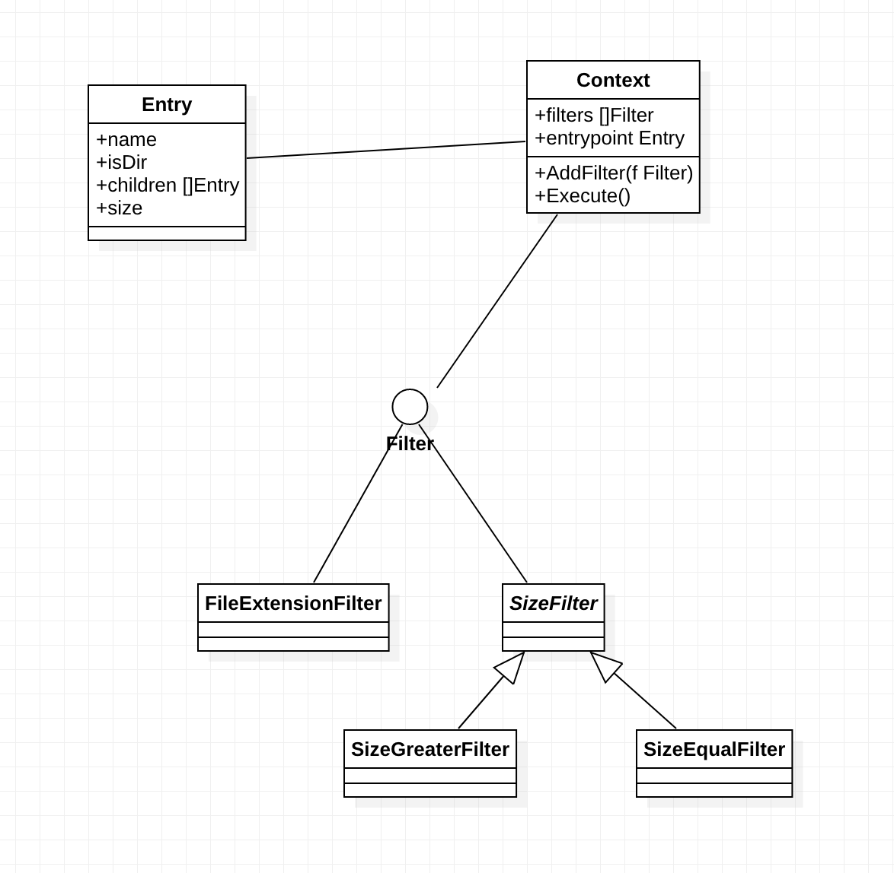

# Amazon VO

## VO cheatsheet

Other coded

1. [ ] 3sum\(fix 1 ptr, then 2sum\)
2. [x] Random Pick with Weight\(prefixSum + binary search\)
3. [x] write a function that 50% return 1, 50% return 0. follow up: utilize the function you just wrote, write another function 75% return 1 and 25% return 0 \(bit\) \([https://massivealgorithms.blogspot.com/2016/08/generate-0-and-1-with-25-and-75.html](https://massivealgorithms.blogspot.com/2016/08/generate-0-and-1-with-25-and-75.html)\)
4. [x] \(bonus\) input is a TreeNode. update all the node values with the sum of its all children \(in-order traversal, update self from left and right, return sum\)
5. [x] Minimum Path Sum \(dp on matrix\)
6. [ ] Simplify Paths\(split + stack\)
7. [ ] Pow\(x,y\) \(divideConquer / bit\)
8. [ ] Evaluate Division \(graph dfs\)
9. [ ] Minimum Genetic Mutation \(bfs / dfs, same as word ladder\)
10. [ ] First Unique Character in a String \(2 pass map, can be optimized based on different scenario in both space and time\)
11. [ ] Interval List Intersections\(merge 2 sorted list + max & min for start and end\)
12. [ ] Count Good Nodes in Binary Tree\(preorder dfs\)
13. [ ] Non-overlapping Intervals\(reverse thinking + sort based on end + dp\)
14. [x] Design HashMap\(bucket + linkedlist\)
15. [ ] Copy List with Random Pointer \(similar to clone graph \| O\(1\) space: change in-place, copy, then rewind\)
16. [ ] Happy Number \(set / list cycle I O\(1\) space\)
17. [x] Design In-Memory File System \(trie-like structure\)
18. [x] Design File System\(same as trie\)
19. [ ] Search Suggestions System \(trie search\)
20. [ ] Subarray Sum Equals K \(prefix sum\)
21. [ ] Longest Univalue Path \(l, r, leftMost, rightMost, global\)
22. [x] Daily Temperatures \(push when t\[stack.peek\(\)\] &gt;= t\[i\], pop otherwise, remember push the last one in after popping\)
23. [x] Single Element in a Sorted Array \(binary search, l &lt; r exit, remember to use clean boundary as we move mid instead of normal template\)
24. [ ] Next Greater Element II \(same as next greater element I, i % n, 2\*n loop\)
25. [x] Remove All Adjacent Duplicates in String II \(pair \(ch, count\)\)
26. [x] Number of Atoms \(similar to basic calculator I, store Map in stack\)
27. [x] Sqrt\(x\) \(binary search, l, r need to be long to prevent overflow, cast into int when return\)
28. [x] path sum I \(maintain sum along path, check sum == target at leaf\)
29. [x] path sum II \(remember to backtrack at last level\)
30. [x] path sum III \(prefix sum\)
31. [ ] coin change II \(dp\[i\]\[j\] = dp\[i - 1\]\[j\] + dp\[i\]\[j - coins\[i - 1\]\]\)
32. [x] Insert Delete GetRandom O\(1\) \(swap with last item in list\)

Tasks

* [x] balanced binary tree
* [x] shortest word distance I 
* [x] shortest word distance II \(merge sort\)
* [ ] synonymous sentence
* [ ] sliding puzzle 
* [ ] reverse bits
* [ ] remove duplicates from sorted list
* [ ] partition label \(greedy, shoot far, expand window, slide window\)
* [ ] best meeting points
* [ ] BST node distance
* [x] longest increasing path in a matrix \(dfs + int\[\]\[\] memo\)
* [ ] number of closed islands
* [ ] next greater node in linked list
* [ ] search suggestion system
* [ ] minimum window substring
* [ ] shortest completing word
* [ ] valid word abbreviation
* [x] valid palindrome I 
* [x] valid palindrome II
* [ ] ~~valid palindrome III \(hard\)~~
* [ ] transform one string to another using minimum number of given operation
* [ ] nested-list-weight-sum
* [x] Account Merge
* [ ] Friend circle
* [ ] number-of-connected-components
* [x] Open the Lock \(bfs, remember to check the first node\)
* [ ] shortest-path-visiting-all-nodes
* [ ] bus-routes
* [x] Reorganize String \(always use map\[ch - 'a'\]--\)
* [ ] data-stream-as-disjoint-intervals
* [ ] median in sliding widow
* [x] decode ways \(watch out leading 0\)
* [ ] Partition equal subset sum
* [ ] common sub-sequence of two \(or more\) strings
* [ ] regular-expression-matching & wild card matching
* [ ] Max sum from root，max sum from any to any
* [ ] Right pointer
* [ ] Rank in a stream
* [ ] unique-binary-search-trees
* [ ] maximum-averge-subtree
* [ ] Queue with stacks
* [ ] Iterator for Combination
* [ ] Find Max Bandwidth
* [ ] copy-list-with-random-pointer
* [ ] shortest-unsorted-continuous-subarray
* [ ] Logger Rate Limiter
* [ ] Web Crawler
* [ ] Number of Longest Increasing Subsequence
* [ ] Longest Substring Without Repeating Characters
* [ ] Flood Fill
* [x] Binary Tree Level Order Traversal II
* [x] Longest Consecutive Sequence \(uf-alike set, push all into set, 2nd loop look up and down to see if can connect them, move boundary and remove connected piece\)
* [ ] Robot Bounded In Circle
* [ ] Maximum Frequency Stack
* [ ] Valid Sudoku
* [ ] Sudoku Solver
* [x] Insert Delete GetRandom O\(1\)
* [ ] Insert Delete GetRandom O\(1\) - Duplicates allowed
* [ ] First unique word in a stream
* [x] Design In-Memory File System
* [x] Design Search Autocomplete System
* [x] Intersection of Two Arrays I \(2 hashset / sort + binary search/ sort + merge\)
* [x] Intersection of Two Arrays II \(\)
* [ ] LFU Cache
* [ ] Divide Array in Sets of K Consecutive Numbers
* [ ] Encode and Decode TinyURL
* [ ] Single Number
* [x] Subtree of Another Tree \(double dc, because we might have duplicates\)
* [ ] Tree Diameter
* [ ] Binary Tree Paths
* [x] The Maze
* [ ] The Maze II
* [ ] Analyze User Website Visit Pattern
* [x] Number of Days Between Two Dates \(calc date from 1971\)
* [x] triangle \(dp or divide conquer + memo\)


https://leetcode.com/discuss/interview-question/124719/Find-the-first-word-in-a-stream-in-whic

h-it-is-not-repeated-in-the-rest-of-the-stream/

Find target word

https://www.1point3acres.com/bbs/thread-617156-1-1.html

given list of tuples: \[\("a", "b"\), \("b", "c".....\] and a target word: "hello", 要 求 判 断 能 否 ⽤ tuples

的 字 母 组 成 target 。 每 个 tuple 只 能 ⽤ ⼀ 次 ， tuple ⾥ 两 个 字 母 是 ⼆ 选 ⼀。

LC 237. Delete Node in a Linked List

hasNext\(\) & Next\(\)

LC 284?

给 ⼀ 个 sorted 的 list of list ， 实 现 bool hasNext\(\) 和 next\(\) ， 刚 开 始 提 出 priority queue ， ⾯ 试 官

说 不 ⽤ 额 外 space ， 后 来 ⽤ pointer 做 的

Reviewed

1. [ ] Robot Bounded In Circle \(dir = \(dir + 3\) % 4 / dir = \(dir + 1\) % 4\)
2. [ ] Rotting Oranges \(same as walls and gates, start from rotten oranges and keep fress counts\)
3. [ ] Most Common Word\(replaceAll, split, set\)
4. [ ] Find Peak Element \(nums\[mid\] &gt; nums\[mid + 1\], go to left, else go to right\)


OOD

* [ ] LRU
* [x] LINUX FIND
* [x] parking lot
* [ ] Amazon Locker
* [ ] restaurant reservation
* [ ] 设计象棋
* [ ] tik-tok-toe
* [ ] 德州扑克
* [ ] 贪吃蛇
* [ ] 设计一个电话簿
* [ ] string parser
* [ ] top N selling products
* [ ] analyze-user-website-visit-pattern
* [ ] 购物车
* [ ] Ticket booking
* [ ] vendor machine

## Linux Find




```java
public class LinuxFindDesign {
    class File {
        String name;
        String extension;
        int size;
        boolean isDir;
        List<File> children;
        Timestamp deleted;
        Timestamp created;
        Timestamp modified;

        File() {
            name = "";
            extension = "";
            size = 0;
            isDir = false;
            children = new ArrayList<>();
        }
    }

    File root = new File();

    class SearchParams {
        String extension;
        Integer minSize;
        Integer maxSize;
        String name;
    }

    interface Filter {
        boolean isValid(SearchParams params, File file);
    }

    class ExtensionFilter implements Filter {
        @Override
        public boolean isValid(SearchParams params, File file) {
            if (params.extension == null) return true;
            return file.extension.equals(params.extension);
        }
    }

    class MinSizeFilter implements Filter {
        @Override
        public boolean isValid(SearchParams params, File file) {
            if (params.minSize == null) return true;
            return file.size >= params.minSize;
        }
    }

    class MaxSizeFilter implements Filter {
        @Override
        public boolean isValid(SearchParams params, File file) {
            if (params.maxSize == null) return true;
            return file.size <= params.maxSize;
        }
    }

    class NameFilter implements Filter {
        @Override
        public boolean isValid(SearchParams params, File file) {
            if (params.name == null) return true;
            return file.name.equals(params.name);
        }
    }

    class FileFilter {
        List<Filter> filters;
        FileFilter() {
            filters = new ArrayList<>();
            filters.add(new ExtensionFilter());
            filters.add(new NameFilter());
            filters.add(new MaxSizeFilter());
            filters.add(new MinSizeFilter());
        }
        public boolean isValid(SearchParams params, File file) {
            for (Filter filter: filters) {
                if (!filter.isValid(params, file)) {
                    return false;
                }
            }
            return true;
        }
    }

    class FileSearcher {
        private FileFilter fileFilter;
        FileSearcher() {
            FileFilter fileFilter= new FileFilter();
        }

        public List<File> search(File root, SearchParams searchParams) {
            List<File> res = new ArrayList<>();
            Queue<File> q = new ArrayDeque<>();
            q.offer(root);
            while(!q.isEmpty()) {
                File file = q.poll();
                if (!file.isDir && fileFilter.isValid(searchParams, file)) {
                    res.add(file);
                    continue;
                }
                for (File neighbor: file.children) {
                    q.offer(neighbor);
                }
            }
            return res;
        }
    }
}
```



## Parking Lot


```java
import java.util.*;
public class ParkingLotDesign {
    enum VehicleSize {
        Motorcycle,
        Compact,
        Large,
    }
    abstract class Vehicle {
        protected VehicleSize size;
        protected String licensePlate;

        public VehicleSize getSize() {
            return size;
        }
    }

    class Motorcycle extends Vehicle {
        public Motorcycle(String id) {
            size = VehicleSize.Motorcycle;
            licensePlate = id;
        }
    }

    class Car extends Vehicle {
        public Car(String id) {
            size = VehicleSize.Compact;
            licensePlate = id;
        }
    }

    class Bus extends Vehicle {
        public Bus(String id) {
            size = VehicleSize.Large;
            licensePlate = id;
        }
    }

    class Level {
        private List<Spot> spots;
        private int availableCount;
        private int floor;

        public Level(int num_spots) {
            spots = new ArrayList<>();
            for (int i = 0; i < num_spots; i++) {
                spots.add(new Spot(floor));
            }
        }

        public int getAvailableCount() {
            return availableCount;
        }

        public void updateAvailableCount() {
            int count = 0;
            for (Spot spot: spots) {
                if (spot.availability) {
                    count++;
                }
            }
            availableCount = count;
        }
    }

    class Spot {
        private boolean availability;
        private int level;
        private VehicleSize size;

        public Spot(int level) {
            this.level = level;
        }

        public void takeSpot() {
            markUnavailable();
        }

        public void clearSpot() {
            markAvailable();
        }

        private boolean getAvailability() {
            return availability;
        }

        private void markAvailable() {
            this.availability = true;
        }

        public void markUnavailable() {
            this.availability = false;
        }

        public VehicleSize getSize() {
            return size;
        }
    }

    class Ticket{
        private Vehicle v;
        private Spot spot;
        private long startTime;

        public Ticket(Vehicle v, Spot spot, long startTime) {
            this.v = v;
            this.spot = spot;
            this.startTime = startTime;
        }
    }

    public class ParkingLot {
        private List<Level> levels;
        private float hourlyRate;

        // @param n number of levels
        // @param num_rows  each level has num_rows rows of spots
        // @param spots_per_row each row has spots_per_row spots
        public ParkingLot(int n, int spots_per_level) {
            levels = new ArrayList<>();
            for (int i  = 0; i < n; i++) {
                levels.add(new Level(spots_per_level));
                levels.get(i).floor = i;
            }
        }

        public boolean parkVehicle(Vehicle v) throws ParkingLotFullException {
            for (Level level : levels) {
                if (level.getAvailableCount() == 0) {
                    continue;
                }
                Spot spot = findSpots(v, level);
                if (spot != null) {
                    spot.markUnavailable();
                    levels.get(spot.level).updateAvailableCount();
                    return true;
                }
            }
            throw new ParkingLotFullException("parking lot is full");
        }

        public void unParkVehicle(Ticket t) {
            t.spot.markAvailable();
            levels.get(t.spot.level).updateAvailableCount();
        }

        public int getAvailableCount() {
            int count = 0;
            for (Level level : levels) {
                count += level.availableCount;
            }
            return count;
        }

        private Spot findSpots(Vehicle v, Level level) {
            for (Spot spot: level.spots) {
                if (canFitIn(spot, v)) {
                    return spot;
                }
            }
            return null;
        }

        private boolean canFitIn(Spot spot, Vehicle v) {
            if (spot.size == VehicleSize.Motorcycle) {
                return v.size == VehicleSize.Motorcycle;
            } else if (spot.size == VehicleSize.Compact) {
                return v.size != VehicleSize.Large;
            } else {
                return true;
            }
        }

        private float calcPrice(Ticket t) {
            Date curTime = new Date();
            return (curTime.getTime() - t.startTime) / (60 * 60 * 1000) * hourlyRate;
        }
    }

    class ParkingLotFullException extends Exception {
        public ParkingLotFullException(String s) {
            super(s);
        }
    }
}
```

## Merge Sort

```java
public class MergeSort {
    public void sortIntegers2(int[] A) {
        if (A == null || A.length == 0)
            return;

        int[] temp = new int[A.length];
        mergeSort(A, 0, A.length - 1, temp);
    }

    private void mergeSort(int[] A, int start, int end, int[] temp) {
        if (start >= end)
            return;

        mergeSort(A, start, (start + end) / 2, temp);
        mergeSort(A, (start + end) / 2 + 1, end, temp);
        merge(A, start, end, temp);
    }

    private void merge(int[] A, int start, int end, int[] temp) {
        int middle = (start + end) / 2;
        int leftIndex = start;
        int rightIndex = middle + 1;
        int index = leftIndex;

        while (leftIndex <= middle && rightIndex <= end) {
            if (A[leftIndex] < A[rightIndex])
                temp[index++] = A[leftIndex++];
            else
                temp[index++] = A[rightIndex++];
        }

        while (leftIndex <= middle)
            temp[index++] = A[leftIndex++];
        while (rightIndex <= end)
            temp[index++] = A[rightIndex++];

        for (int i = start; i <= end; i++)
            A[i] = temp[i];

    }
}

```

## Quick Sort

```java
public class QuickSort {
    public void sortIntegers(int[] A) {
        if (A == null || A.length == 0)
            return;
        quickSort(A, 0, A.length - 1);
    }

    private void quickSort(int[] A, int start, int end) {
        if (start >= end)
            return;

        int l = start;
        int r = end;
        // key1: get the value of pivot, not index
        int pivot = A[(start + end) / 2];
        // key2: l <= r, not l < r
        while (l <= r) {
            // key3: A[l] < pivot, not A[l] <= pivot
            while (l <= r && A[l] < pivot)
                l++;
            while (l <= r && A[r] > pivot)
                r--;
            if (l <= r) {
                int temp = A[l];
                A[l] = A[r];
                A[r] = temp;
                l++;
                r--;
            }
        }

        quickSort(A, start, r);
        quickSort(A, l, end);
    }
}
```

## Quick Select

```java
public class QuickSelect {
    public int findKthLargest(int[] nums, int k) {
        if (nums == null || nums.length == 0)
            return -1;
        return quickSelect(nums, 0, nums.length - 1, k);
    }

    private int quickSelect(int[] nums, int start, int end, int k) {
        if (start == end)
            return nums[start];

        int l = start;
        int r = end;
        int pivot = nums[(start + end) / 2];
        while (l <= r) {
            while (l <= r && nums[l] > pivot)
                l++;
            while (l <= r && nums[r] < pivot)
                r--;

            if (l <= r) {
                int temp = nums[l];
                nums[l] = nums[r];
                nums[r] = temp;
                l++;
                r--;
            }
        }

        if (start + k - 1 <= r)
            return quickSelect(nums, start, r, k);
        if (start + k - 1 >= l)
            return quickSelect(nums, l, end, k - (l - start));

        return nums[r + 1];
    }
}
```

## Bucket Sort

```java
public class BucketSort {
    public void sort(int[] array, int numberOfBuckets) {
        var i = 0;
        for (var bucket : createBuckets(array, numberOfBuckets)) {
            Collections.sort(bucket);
            for (var item : bucket)
                array[i++] = item;
        }
    }

    private List<List<Integer>> createBuckets(int[] array, int numberOfBuckets) {
        List<List<Integer>> buckets = new ArrayList<>();
        for (var i = 0; i < numberOfBuckets; i++)
            buckets.add(new ArrayList<>());

        for (var item : array)
            buckets.get(item / numberOfBuckets).add(item);

        return buckets;
    }
}

```

## Bubble Sort

```java
public class BubbleSort {
    public void sort(int[] arr) {
        boolean flag;
        for (int i = arr.length - 1; i >= 1; i--) {
            flag = true;
            for (int j = 0; j < i; j++) {
                if (arr[j] > arr[j + 1]) {
                    swap(j, j + 1, arr);
                    flag = false;
                }
            }
            if (flag)
                return;
        }
    }

    public void swap(int a, int b, int[] arr) {
        var temp = arr[b];
        arr[b] = arr[a];
        arr[a] = temp;
    }
}

```

## Couting Sort

```java

public class CountingSort {
    public static void sort(int[] arr, int max) {
        if (arr == null)
            return;

        var countArr = new int[max + 1];
        for (int i = 0; i < arr.length; i++) {
            var key = arr[i];
            countArr[key]++;
        }

        var pointer = 0;
        for (int key = 0; key < countArr.length; key++) {
            var count = countArr[key];
            if (count != 0)
                for (int j = 0; j < count; j++) {
                    arr[pointer] = key;
                    pointer++;
                }
        }

        // compact implementation
        // int[] counts = new int[max + 1];
        // for (var item : array)
        // counts[item]++;

        // var k = 0;
        // for (var i = 0; i < counts.length; i++)
        // for (var j = 0; j < counts[i]; j++)
        // array[k++] = i;
    }
}

```

## MinHeap



[https://www.jiuzhang.com/problem/heapify/](https://www.jiuzhang.com/problem/heapify/)

```java
public class Solution {
    class Node {
        int key;
        int val;

        Node(int key, int val) {
            this.key = key;
            this.val = val;
        }
    }

    private Node[] nodes = new Node[20];
    private int size;

    public void insert(int key, int val) {
        if (isFull())
            throw new IllegalArgumentException();
        nodes[size++] = new Node(key, val);
        bubbleUp();
    }

    public int remove(){
        if (isEmpty()) 
            throw new IllegalArgumentException();
        int ret = nodes[0].val;
        nodes[0] = nodes[size - 1];
        size--;

        bubbleDown();

        return ret;
    }

    private void bubbleUp() {
        int i = size - 1;
        while (i > 0 && nodes[i].key < nodes[(i - 1) / 2].key) {
            swap(nodes, i, (i - 1) / 2);
            i = (i - 1) / 2;
        }
    }

    private void bubbleDown() {
        int i = 0;
        while (i < nodes.length) {
            int smallest = i;
            if (2 * i + 1 < nodes.length && nodes[2 * i + 1].key < nodes[smallest].key) {
                smallest = 2 * i + 1;
            }
            if (2 * i + 2 < nodes.length && nodes[2 * i + 2].key < nodes[smallest].key) {
                smallest = 2 * i + 2;
            }
            if (smallest == i) {
                break;
            }
            swap(nodes, smallest, i);
            i = smallest;
        }
    }

    private void swap(Node[] arr, int a, int b) {
        Node temp = arr[a];
        arr[a] = arr[b];
        arr[b] = temp;
    }

    private boolean isFull() {
        return size == nodes.length;
    }

    private boolean isEmpty() {
        return size == 0;
    }

    private void heapify(Node[] arr) {
        for (int i = (arr.length - 1) / 2; i >= 0; i--) {
            siftDown(arr);
        }
    }

    private void siftDown(Node[] arr) {
        int i = 0;
        while (i < arr.length) {
            int smallest = i;
            if (2 * i + 1 < arr.length && nodes[2 * i + 1].val < arr[smallest].val) {
                smallest = 2 * i + 1;
            }
            if (2 * i + 2 < arr.length && nodes[2 * i + 2].val < arr[smallest].val) {
                smallest = 2 * i + 2;
            }
            if (smallest == i) {
                break;
            }
            swap(arr, smallest, i);
            i = smallest;
        }
    }
}
```


