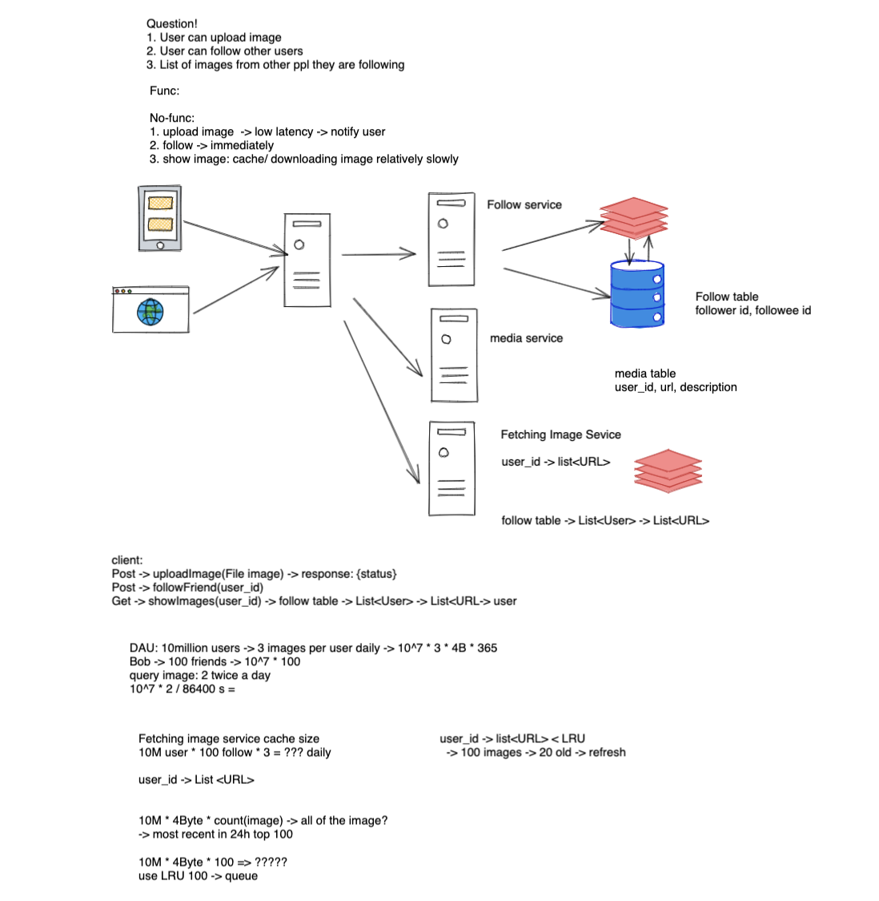

# FB documentation

## 08/032020

### Phone Interview

```java
Welcome to Facebook!

This is just a simple shared plaintext pad, with no execution capabilities.

When you know what language you would like to use for your interview,
simply choose it from the dropdown in the top bar.

Enjoy your interview!
  
  Hello World
  
Question Statement
Input: ((( Output: 3
Input: ()) Output: 1
Input: (()) Output: 0
Input: )( Output: 2

The first input is missing 3 closing parentheses, so the output should be 3. 
The second input is missing an opening parentheses at the beginning, so the output is 1. 
The third input is perfectly balanced, so the output is 0. 
The last input is unbalanced despite having equal number of each parentheses, so the output is 2.
         
public int count(String str) {
  if (str == null || str.length() == 0) return 0;
  
  int l = 0, r = 0;
  
  for (int i = 0; i < str.length(); i++) {
    char ch = str.charAt(i);
    if (ch == '(') {
      l++;
    } else if (ch == ')' && l > 0) {
      l--;
    } else {
      r++;
    }
  }
  
  return l + r;
}
         
Area of a large island

Find the maximum area of an island when you are allowed to flip one 0 to 1.

Input:
[[1, 0],
 [0, 1],
 [1, 1]]
Output: 5
Reason: Change 0 at (0, 1) to 1 and we get an island with area = 5

Input:
[[1, 1, 1],
 [1, 1, 1]]
Output: 6
Explanation: There are no 0's and one island with area = 6

public int maxArea(int[][] matrix) {
  if (matrix == null) return 0;
  
  // O(m * n)
  UnionFind uf = new UnionFind();
  int m = matrix.length, n = matrix[0].length;
  for (int i = 0; i < m; i++) {
    for (int j = 0; j < n; j++) {
      if (matrix[i][j] == 0) continue;
      // O(1) for union find add
      uf.add(i * n + j);
    }
  }
  
  int[] dx = { -1, 1, 0, 0 };
  int[] dy = { 0, 0, -1, 1 };
  
  // O(m * n)
  for (int i = 0; i < m; i++) {
    for (int j = 0; j < n; j++) {
      if (matrix[i][j] == 0) continue;
      for (int k = 0; k < 4; k++) {
        int nx = i + dx[k], ny = j + dy[k];
        if (nx < 0 || nx >= m || ny < 0 || ny >= n || matrix[nx][ny] == 0) continue;
        uf.union(i * n + j, nx * n + ny);
      }
    }
  }
  
  int max = 0;
  
  for (int i = 0; i < m; i++) {
    for (int j = 0; j < n; j++) {
      if (matrix[i][j] == 1) continue;
      
      int area = 1;
      Set<Integer> set = new HashSet<>();
      for (int k = 0; k < 4; k++) {
        int nx = i + dx[k], ny = j + dy[k];
        if (nx < 0 || nx >= m || ny < 0 || ny >= n || matrix[nx][ny] == 0) continue;
        int p = uf.find(nx * n + ny);
        if (set.contains(p)) continue;
        area += uf.sizeMap.get(p);
        set.add(p);
      }
      
      max = Math.max(max, area);
    }
  }
  
  if (max == 0) return m * n;
  
  return max;
  
  // O(m * n) 
}  
```

### Round1

Koko eat bananas, background was truck

### Round2

```java
Welcome to Facebook!

This is just a simple shared plaintext pad, with no execution capabilities.

When you know what language you would like to use for your interview,
simply choose it from the dropdown in the top bar.

Enjoy your interview!

1. Given a root to a binary tree, implement an iterator to support the pre order traversal. 

   1
  / \
  2 3
  /
 4 
Preorder - 1, 2, 4, 3
s: 
1243
class Node {
    Value value;
    Node left;
    Node right;
}

class PreOrderIterator {
    Stack<Node> stack;
  
    PreOrderIterator(Node root) {
      stack = new Stack<>();
      stack.push(root);
    }
  
    boolean hasNext() {
        // Returns true if has next value to iterate.
      return !stack.isEmpty();
    }
    
    Value next() {
        // returns next value and updates iterator.
        // throw exception when there is no next element.
      if (!hasNext()) throw new NoSuchElementException();
      
      Node node = stack.pop();
      Value res = node.value;
      
      if (node.right != null) {
        stack.push(node.right);
      }
      if (node.left != null) {
        stack.push(node.left);
      }
      
      return res;
    }

}

2. You're given a calendar year represented as a char array that contains either H or W where:
H = Holiday W = Workday
Given a number of Personal Time-Off days (PTO), maximize the length of the longest vacation you can take.

example: [W, H, H, W, W, H, W], PTO = 2 --> Your maximum vacation is 5 days.

int maxVacation(char[] arr, int PTO) {
  if (arr == null || arr.length == 0 || PTO < 0) throw new IllegalArgumentException();
  
  int max = 0, j = 0, count = 0;
  for (int i = 0; i < arr.length; i++) {
    while (j < arr.length && count <= PTO) {
      if (arr[j] == 'W') {
        if (count + 1 <= PTO) {
          count++;
        } else {
          break;
        }
      }
      max = Math.max(max, j - i + 1);
      j++;
    }
    
    if (arr[i] == 'W') count--;
  }
  
  return max;
}
```

### Round3



### Round4

```java
Welcome to Facebook!

This is just a simple shared plaintext pad, with no execution capabilities.

When you know what language you would like to use for your interview,
simply choose it from the dropdown in the top bar.

Enjoy your interview!

  
  
Given a list of sorted integers, return a list of its squares, also sorted.

[1, 2, 3, 5] -> [1, 4, 9, 25]
[-5, -3, 1, 2, 3, 5]
1  4  9  9  25  25
  
[-5, 0, 1, 1, 2, 3, 5]
    r l
     0 1 1 4 9 25 25
  
int[] sortedSquare(int[] nums) {
  if (nums == null || nums.length == 0) return new int[0];
  
  int l = 0, r = nums.length - 1, idx = nums.length - 1;
  int[] res = new int[nums.length];
  
  while (l <= r) {
    if (Math.abs(nums[l]) >= Math.abs(nums[r])) {
      res[idx--] = nums[l] * nums[l];
      l++;
    } else {
      res[idx--] = nums[r] * nums[r];
      r--;
    }
  }
  
  return res;
}
```

